# AGENTS.md

> **Canonical engineering reference for the Business & Brand Origin Stories pipeline.**
>
> This file is the source of truth for *how* this project is built. Any AI agent (or human) working on the codebase must read this first and **update it** whenever a feature is added, a module is changed, or an architectural decision shifts. Keeping this file current is part of the definition-of-done for every change.

---

## 1. What this project does

The pipeline produces 10–15 minute comic-book-styled YouTube documentaries about real business / brand origin, rise-and-fall, scandal, and disruption stories (Theranos, WeWork, Blockbuster, Wirecard, Toys R Us, Polaroid, Kodak, etc.). It runs unattended on a Mac with local MLX inference (Qwen/Gemma/Kokoro/Qwen3-VL via a gateway at `10.0.4.250:9000`) plus a SearXNG instance at `10.0.4.252:8080` for web research and a local `flux` CLI binary for image generation. xAI Grok is used as a fallback image generator when FLUX renders are flagged by the VLM.

A single cron-driven entry point — `run_orchestrator.sh` — runs one stage of one episode per invocation. Stages are numbered S1–S12 and a per-episode workspace under `episodes/EP_NNN_<slug>/` carries artifacts forward. The pipeline is serial-by-stage, restartable, lock-protected, and idempotent at the stage boundary.

**Critical operator constraints:**
- API keys live in `.env` only. **Never** put a real key in `config.yaml` — GitHub secret-scanning will reject the push.
- `/Users/cantemir/Projects/maritime/` is a sibling reference project and **must never be touched** from this one.
- The python orchestrator must detach (nohup + `&` + `</dev/null`) so external schedulers can't SIGTERM it mid-stage.

---

## 2. Architecture diagram

```mermaid
flowchart TB
    %% ============== Entry ==============
    cron[(External scheduler<br/>cron / Mac Automator / Hammerspoon)]
    sh[run_orchestrator.sh<br/>detaches via nohup]
    cli[pipeline.hermes_orchestrator<br/>CLI + dispatch]
    cron --> sh --> cli

    %% ============== State ==============
    subgraph STATE [state/]
        queue[(episode_queue.json<br/>queue + rolling_window)]
        used[(used_topics.json)]
        lock[(locks/orchestrator.lock)]
    end
    cli -. acquires .-> lock
    cli <-->|load/save| queue
    cli <-->|read/append| used

    %% ============== Stages ==============
    subgraph STAGES [pipeline/stages/  — one runs per invocation]
        S1[S01 Topic Discovery]
        S2[S02 Source Gathering]
        S3[S03 Fact Extraction]
        S4[S04 Fact Verification]
        S5[S05 PD Asset Hunt]
        S6[S06 Script Generation]
        S7[S07 Script Critique]
        S8[S08 Beat Sheet]
        S9[S09 FLUX Render + Grok fallback]
        S10[S10 Kokoro TTS]
        S11[S11 Audio Post]
        S12[S12 Video Assembly]
        S13[S13 Packaging<br/>titles + thumbs + Shorts]
        S14[S14 Performance writeback<br/>OFF-BAND — manual --analyse-performance]
        S1 --> S2 --> S3 --> S4 --> S5 --> S6
        S6 --> S7 --> S8 --> S9 --> S10 --> S11 --> S12 --> S13
        S14 -. injects perf history into prompts of .-> S1
        S14 -. injects perf history into prompts of .-> S6
        S14 -. injects perf history into prompts of .-> S8
    end
    cli --> STAGES

    %% ============== Adapters ==============
    subgraph ADAPTERS [pipeline/  — adapter layer]
        LLM[llm.py<br/>writer / critic / extractor]
        TTS[tts.py<br/>Kokoro]
        FLUX[flux.py<br/>flux CLI subprocess]
        VLM[vlm.py<br/>Qwen3-VL judge + caption]
        GROK[grok.py<br/>xAI image regeneration]
        BROW[browser.py<br/>SearXNG + requests]
        WIKI[wikimedia.py<br/>Commons API]
        TREND[trends.py<br/>demand validation]
        MUSIC[music_library.py<br/>operator-curated bed]
        STASH[generic_stash.py<br/>Tier-2 image fallback]
        FFB[ffmpeg_builder.py]
        CONST[constraints.py<br/>cooldown picker]
    end

    %% ============== External services ==============
    LLMGW[(LLM gateway<br/>10.0.4.250:9000<br/>Qwen/Gemma/Kokoro/VLM)]
    SXNG[(SearXNG<br/>10.0.4.252:8080)]
    FLUXBIN[/flux CLI binary/]
    XAI[(xAI API<br/>api.x.ai/v1)]
    COMMONS[(Wikimedia Commons API)]

    LLM --> LLMGW
    TTS --> LLMGW
    VLM --> LLMGW
    FLUX --> FLUXBIN
    GROK --> XAI
    BROW --> SXNG
    WIKI --> COMMONS
    TREND --> BROW

    %% Stage→adapter bindings
    S1 --- LLM
    S1 --- TREND
    S2 --- BROW
    S3 --- LLM
    S4 --- LLM
    S5 --- BROW
    S5 --- WIKI
    S5 --- VLM
    S6 --- LLM
    S7 --- LLM
    S8 --- LLM
    S9 --- FLUX
    S9 --- VLM
    S9 --- GROK
    S10 --- TTS
    S11 --- MUSIC
    S11 --- FFB
    S12 --- FFB
    S5 --- STASH
    S1 --- CONST

    %% ============== Episode workspace ==============
    subgraph WS [episodes/EP_NNN_slug/]
        R[00_research/<br/>incident.json, raw/, extracted/]
        FC[01_factcheck/]
        SC[02_script/<br/>script.txt, beat_sheet.json]
        AS[03_assets/<br/>pd/, flux/, grok/, quarantine/]
        AU[04_audio/<br/>chunks/, voice_full.wav, final_mix.wav]
        VI[05_video/<br/>clips/, final.mp4, srt+vtt]
        MD[06_metadata/]
    end
    S1 --> R
    S2 --> R
    S3 --> FC
    S4 --> FC
    S5 --> AS
    S6 --> SC
    S7 --> SC
    S8 --> SC
    S9 --> AS
    S10 --> AU
    S11 --> AU
    S12 --> VI
```



The diagram is approximate — for the authoritative wiring, read `pipeline/hermes_orchestrator.py` (the `STAGE_DISPATCH` table) and the docstring at the top of each `pipeline/stages/sNN_*.py`.

---

## 3. Repository layout

```
business_success_stories/
├── AGENTS.md                    ← this file
├── README.md                    ← operator-facing quickstart
├── config.yaml                  ← all runtime knobs
├── .env / .env.example          ← secrets (gitignored / template)
├── pyproject.toml               ← dependencies
├── run_orchestrator.sh          ← cron entry point; detaches python
├── pipeline/                    ← all code
│   ├── __init__.py              ← SSL bootstrap + .env loader
│   ├── hermes_orchestrator.py   ← CLI + lock + stage dispatch
│   ├── config.py                ← typed accessors over config.yaml
│   ├── state.py                 ← queue, locks, rolling window, used_topics
│   ├── constraints.py           ← A/N/V cooldown picker
│   ├── llm.py                   ← LLM gateway client (writer/critic/extractor)
│   ├── tts.py                   ← Kokoro TTS client
│   ├── flux.py                  ← `flux` CLI subprocess adapter
│   ├── vlm.py                   ← Qwen3-VL judge + captioner
│   ├── grok.py                  ← xAI image regeneration (S9 fallback)
│   ├── browser.py               ← SearXNG search + requests fetch
│   ├── wikimedia.py             ← Commons MediaWiki API client
│   ├── trends.py                ← S1 demand validation (YouTube + news counts)
│   ├── music_library.py         ← operator-curated music bed picker
│   ├── generic_stash.py         ← Tier-2 generic image fallback
│   ├── ffmpeg_builder.py        ← ffmpeg pipeline assembly
│   ├── lexicon/
│   │   └── pronunciation_overrides.yaml   ← Kokoro pronunciation map
│   ├── lint/
│   │   └── forbidden_phrases.txt          ← S6/S7 phrase blocklist
│   ├── sources/__init__.py      ← S2 SearXNG recipes (currently inline in S2)
│   ├── stages/                  ← S01–S12 modules
│   ├── style_profiles/          ← V1/V2 visual styles, archetypes, narrators
│   ├── prompts/                 ← every LLM prompt template
│   └── tools/
│       └── scan_music_library.py          ← music manifest scaffolder
├── drafts/                      ← operator-authored manual-topic JSONs
├── assets/
│   ├── music_library/           ← operator-curated music + manifest.json
│   └── generic_stock/           ← Tier-2 generic image stash
├── state/
│   ├── episode_queue.json       ← queue + rolling_window
│   ├── used_topics.json         ← permanent dedup set
│   └── locks/orchestrator.lock  ← cross-process advisory lock
├── episodes/                    ← per-episode workspaces (see §8.13)
└── logs/                        ← per-day orchestrator log files
```

---

## 4. Top-level files

### `config.yaml`
All runtime knobs. Loaded via `pipeline/config.py` with `${root}` / `${path.subkey}` token substitution. Operator-editable. Reload requires no code change — every adapter reads it via the cached `load_config()` singleton at process start.

Major blocks:
- `channel` — branding (channel name, brand color, contact email).
- `paths` — `${root}` is optional; defaults to the directory containing `config.yaml`.
- `models` — logical model keys consumed by the LLM gateway. `mock_mode: true` makes every adapter return canned data.
- `production` — duration / word-count targets, title-card styling, fade timings. *(retuned 2026-05-26 Batch A — 18-min midpoint, 2300-word target.)*
- `quality_gates` — minimum source counts, beat counts, script word counts, audio LUFS bounds. *(beat/word windows widened 2026-05-26 Batch A.)*
- `constraints` — `rolling_window_*` cooldowns for archetype/narrator/style.
- `orchestrator` — lock staleness, max topic-discovery retries, per-invocation budget.
- `search` — SearXNG endpoint + tuning.
- `music_library` — bed-track config + voice dynaudnorm settings.
- `grok` — xAI image-regeneration endpoint and model. **API key in env only**.
- `flux_cli` — CLI binary + render dims (1920×1080, 24 steps).
- `asset_hunt` — master toggle for S5 (currently `false` — comic-style channel, FLUX-only).
- `generic_stash` — Tier-2 image fallback thresholds.
- `stock_sources` — Smithsonian / Europeana / Pixabay PD sources.
- `pd_upscale` — Real-ESRGAN + GFPGAN settings (currently off).
- `image_qa` — VLM judge thresholds + PD-vs-FLUX routing.
- `topic_validation` — S1 demand probe thresholds (see §5.10).
- `archetypes` / `narrators` / `visual_styles` — A/N/V dimension catalogs.

### `.env` / `.env.example`
Operator secrets. `.env` is **gitignored** and loaded into `os.environ` at package import time by `pipeline/__init__.py`. Keys recognised:
- `XAI_API_KEY` (canonical) or `GROK_API_KEY` (alias) — xAI image API.
- Any future API keys (Pixabay, Europeana etc. when their stock sources need them).

### `pyproject.toml`
Project metadata + dependencies. Uses standard PyYAML, requests, Pillow, numpy, scipy, soundfile, num2words, sentence-transformers, pypdf, bs4, lxml, imagehash, tenacity, tqdm, pydantic. Plus truststore + certifi for SSL.

### `run_orchestrator.sh`
Cron-friendly wrapper. **Critical contract**: the python process must detach so the external scheduler's per-invocation shell timeout cannot SIGTERM it mid-stage. The script returns in <1 second; python keeps running in the background until the stage completes; the orchestrator lock prevents concurrent runs.

```bash
nohup python3 -m pipeline.hermes_orchestrator "$@" </dev/null >>"${LOGFILE}" 2>&1 &
```

### `README.md`
Operator-facing quickstart. Less detail than this AGENTS.md; intended for the project owner, not for an AI agent reading the codebase cold.

---

## 5. Adapter layer (`pipeline/*.py`)

### 5.1 `__init__.py`
SSL bootstrap. macOS python.org installer ships an outdated cert bundle; `truststore` patches stdlib `ssl` to use the OS keychain, with `certifi` as fallback for commercial roots that the keychain may not trust. Also loads `.env` into `os.environ` at import time so adapters never have to read the file directly.

### 5.2 `config.py`
Typed accessors over `config.yaml`. The `Config` dataclass exposes one property per top-level block (`config.grok`, `config.image_qa`, `config.topic_validation`, etc.) and each property layers in default values so missing keys don't crash. `${root}` and `${path.subkey}` substitution lives here. `load_config()` is `@lru_cache(maxsize=1)` — config is read once per process.

### 5.3 `state.py`
Queue + lock + rolling window + per-episode workspace primitives.
- `file_lock(path, stale_seconds)` — `fcntl.LOCK_EX | LOCK_NB` advisory lock with stale-lock reclamation (default 6h).
- `load_queue() / save_queue()` — atomic JSON read/write of `state/episode_queue.json`.
- `enqueue_episodes(n)` — append N **empty** episode records (S1 will fill them via the LLM).
- `enqueue_manual_episode(incident, ...)` — append ONE episode with the incident pre-filled by the operator. Sets `incident_origin: "manual"` so S1 short-circuits.
- `next_pending_episode(queue)` — find the next runnable (episode, stage_id) pair.
- `mark_stage_done / mark_stage_failed` — advance episode through `current_stage`; failed stages mark `needs_human` and add a blocker.
- `push_rolling_window(queue, archetype, narrator, visual_style, country=...)` — append to rolling-window history (kept to last 6 per dimension). Called by S1 on every successful commit.
- `episode_workspace(episode_id, slug)` — create + return the `episodes/EP_NNN_<slug>/` directory tree.
- `add_used_topic / load_used_topics / topic_already_used` — permanent dedup set at `state/used_topics.json` (lowercased company names).

### 5.4 `constraints.py`
The cooldown picker. `pick_assignment(rolling_window, seed, story_kind=None)` returns an `Assignment(archetype, narrator, visual_style)` such that none of the three collides with the most recent N entries (per-dimension N comes from `config.constraints.rolling_window_*`). When all options are forbidden, falls back to the *least recently used*.

*(Batch G 2026-05-28)* `story_kind` gates narrators via the `suits_story_kinds` field in `config.yaml > narrators`. Narrators without that field are universal (legacy N1-N4); the three wit-driven narrators N5/N6/N7 each declare a subset of story_kinds they fit. `_eligible_narrators()` filters the pool BEFORE the cooldown check, so e.g. Felix (N5) never gets picked for an `underdog_comeback` story. Pins on the episode record (set via `--narrator N5` CLI flag) override the cooldown engine's choice entirely.

### 5.5 `llm.py`
LLM gateway client. `LLM(role)` where `role ∈ {"writer", "critic", "extractor"}` picks the model from `config.models.llm_*`. Public surface:
- `complete_text(prompt, temperature, ...)` → plain string.
- `complete_json(prompt, temperature, ...)` → parsed dict, with robust JSON extraction (strips code fences, locates the first balanced `{...}` if the model wraps with prose).
- `mock_mode` returns canned business-story shapes that satisfy the schemas of S1/S3/S4/S7 so end-to-end mock runs succeed.

### 5.6 `tts.py`
Kokoro TTS client + backend dispatcher. Hits the gateway with `{voice, speed, text}` and writes WAV. S10 chunks the script into beat-sized segments and concatenates with a brief silence between. *(Batch D 2026-05-27 added `make_tts(narrator_id)` — a factory that reads `cfg.tts.backend ∈ {kokoro, elevenlabs}` and returns the matching adapter. S10 uses the factory; backend switch is one config-line flip with graceful fall-back.)*

### 5.7 `flux.py`
`flux` CLI subprocess adapter. Replaces the maritime project's HTTP-server-based FLUX adapter. Calls:
```
flux "<prompt>" --height 1080 --width 1920 --steps 24 --seed N --output /abs/path.png
```
`FluxRequest` carries `prompt`, `negative_prompt` (folded into the prompt as `-- avoid: ...` since the CLI has no separate flag), and `output_path`. `render_batch_with_retry(req, num_candidates, seed_offset)` runs the CLI N times with `seed_offset+i`; on non-zero exit, retries once with the next seed. No img2img support — PD asset references degrade to text-only grounding.

### 5.8 `vlm.py`
Qwen3-VL adapter. Two operations:
- `judge(image_path, prompt_used)` → `ImageVerdict(score, prompt_match, anatomy_ok, artifacts, verdict ∈ {pass|borderline|reject}, reasoning)`. Used by S9 to grade FLUX renders.
- `caption(image_path)` → short comic-panel-style caption. Used by S5 Phase 5 (generic stash) and S5 Phase 0/1 (PD asset captions for downstream semantic match in S8).

### 5.9 `grok.py`
xAI image-regeneration client. Used by S9 when the VLM flags a FLUX render for malformed text or anatomy issues. **POSTs JSON** to `/v1/images/generations` with `{model, prompt, resolution: "2k", aspect_ratio: "16:9", n: 1}` — text-to-image only, no reference image. Handles both URL and base64 response shapes via `_write_response_image`. API key from `XAI_API_KEY` / `GROK_API_KEY` env (preferred) or `config.grok.api_key` (back-compat only — keep empty).

### 5.10 `trends.py` *(added 2026-05-26)*
S1 demand-validation primitives. All probes go through SearXNG (same backend as S2 source gathering — no new infrastructure).
- `youtube_video_count(query, browser)` — `categories=videos` count. Returns -1 on adapter failure (caller treats -1 as "unknown, don't reject").
- `recent_news_count(query, browser)` — `categories=news` count. Advisory only.
- `validate_candidate(candidate, cfg_validation, browser)` → `ValidationResult(ok, reason, signals)`. Rejects if YouTube count is below `min_youtube_results` (obscure) or above `max_youtube_results` (saturated).
- `non_us_required(queue, ratio, lookback)` — reads rolling-window `countries` and returns True iff non-US share has fallen below target. Cold-start exempt (returns False for windows of length < 2).

### 5.11 `browser.py`
SearXNG search + plain `requests` fetch.
- `search(query, n_results, categories="")` — set `categories="videos"` / `"news"` / `"images"` to route through the corresponding SearXNG engine set. Image-search returns the direct `img_src` URL in `.url` (S5 Phase 2 relies on this).
- `fetch(url, timeout)` → `FetchResult(url, status, content_type, text, bytes_len)`.
- `download(url, dest)` → bool.
- `wayback_url(original_url, when="2*")` — build a Wayback Machine URL for paywalled-domain fallback (S2).
- Mock mode returns canned business-story content keyed on a SHA of the query.

### 5.12 `wikimedia.py`
Commons MediaWiki API client. S5 uses this for license-clean image hits instead of relying on SearXNG's flaky `site:commons.wikimedia.org` routing. Returns image URLs with structured `extmetadata` (license, author, source) so the caller doesn't have to scrape.

### 5.4b `titles.py` *(added Batch D 2026-05-27)*
Generates N (default 10) candidate YouTube titles per episode via the writer LLM using `prompts/title_variants.txt`. Each variant is tagged with a style hypothesis (`curiosity_gap, shock_value, outcome_first, named_person, question, contrarian, number_anchored, before_after, time_anchored, character_voice`) and a `predicted_ctr_band ∈ {high, medium, low}`. Output: `06_metadata/titles.json`. S13 calls this in Phase 1.

### 5.4c `thumbnails.py` *(added Batch D 2026-05-27)*
Generates 5 Pillow-composited thumbnail variants (1280×720 JPG). Fixed layouts: `founder_closeup, split_frame, big_number, shocked_face, noir` (noir only fires when `visual_style=V2`). Backdrop is the strongest FLUX-rendered beat image (prefers `founder_portrait` intent). Channel logo composited at `assets/branding/channel_mark.png` when present. Output: `05_video/thumbnails/thumb_<layout>.jpg`. Operator picks top 3 for YouTube native A/B test.

### 5.4d `asr.py` *(added Batch D 2026-05-27)*
Whisper.cpp wrapper for Shorts subtitles. `transcribe(wav_path)` returns word-level `Segment(start_seconds, end_seconds, text)` segments. Falls back gracefully when the `whisper-cli` binary isn't on PATH (logs a warning, returns None — Shorts get generated without subtitles). Configurable model name + path via `cfg.asr`.

### 5.4e `shorts.py` *(added Batch D 2026-05-27)*
Picks 3 dramatic 30-second windows via `prompts/shorts_select.txt`, cuts each as 1080×1920 vertical with hard-burned subtitles (Q-D1: configurable via `cfg.packaging.shorts_burn_subtitles`). Reads `voice_timing.json` to resolve `start_beat_id` → seconds. Output: `05_video/shorts/short_NN.mp4` + `manifest.json`.

### 5.4g `youtube_analytics.py` *(added Batch E 2026-05-27)*
YouTube Data + Analytics API client. OAuth installed-app flow via `authorize_oauth()` (one-time browser dance, refresh token cached at `state/youtube_oauth_token.json`). `YouTubeAnalytics().fetch_episode(video_id)` returns an `EpisodePerformance` dataclass with views, likes, CTR, AVD, retention curve, peak drop position, top traffic sources, impressions. Mock mode returns a canned response so the feedback loop is exercisable without real OAuth.

### 5.4h `performance_summary.py` *(added Batch E 2026-05-27)*
Formats `state/performance_history.json` into prompt-ready strings consumed by S1 / S6 / S8. `summarise_for_prompt(history, k=20)` returns a dict with keys: `top_performing_story_kinds, worst_performing_story_kinds, retention_dip_warnings, visual_intents_that_retained, visual_intents_that_lost_viewers`. Q-E2 confirmed: summarised pattern + up to 3 concrete example episode IDs per warning. Empty / placeholder strings when fewer than 2 published episodes have been analysed.

### 5.4f `elevenlabs.py` *(added Batch D 2026-05-27, wired but disabled)*
ElevenLabs TTS adapter with the same `synthesize_script` interface as Kokoro. Activates when `cfg.tts.backend == "elevenlabs"`; `ELEVENLABS_API_KEY` must be in `.env`. Falls back to Kokoro on init failure (missing key) so flipping the backend is safe to try. Per-narrator voice_id pinning via `cfg.tts.elevenlabs.voice_id_map`.

### 5.13b `sfx_library.py` *(added Batch C 2026-05-27)*
Operator-curated SFX library. `SFXLibrary().pick_cue(cue, beat_id, max_duration_seconds)` returns an `SFXPick(path, cue, duration_seconds, gain_db_hint)` matching the named cue from the catalog (`typewriter, keyboard, phone_ring, applause, door_slam, traffic_hum, market_bell, newsprint, clock_tick`). Deterministic per `(cue, beat_id)`. Disabled by default; flip `cfg.sfx_library.enabled` to true after dropping license-clean clips into `assets/sfx_library/` and running `python -m pipeline.tools.scan_sfx_library` to backfill durations. License/attribution fields match the music manifest schema.

### 5.13 `music_library.py`
Replaces the maritime project's MusicGen / Stable Audio Open generators. `MusicLibrary().pick_bed(topic_record, narrator_id, target_seconds)` runs a token-overlap scorer between topic keywords and per-track `mood + instruments + tags`, returns an ordered list of `(track_path, gain_db_hint)` tuples whose total duration ≥ target. S11 concatenates with crossfade. Operator authors `assets/music_library/manifest.json` by hand (see `pipeline/tools/scan_music_library.py` for the skeleton). *(added Batch A 2026-05-26)* `MusicLibrary.license_report(file_names)` returns per-track `{license, attribution, source_url}` entries that S12 emits to `06_metadata/license_attributions.txt` for paste into the YouTube description.

### 5.14 `generic_stash.py`
Tier-2 image fallback. Operator drops generic atmospheric photos into `assets/generic_stock/`; S5 Phase 5 captions them via VLM and persists `manifest.json`. S8 Pass 2.5 evaluates stash entries only for beats that already routed past Pass 1 (incident-specific PD direct use) and Pass 2 (PD as reference). For comic-style episodes the stash is rarely picked because the FLUX style dominates; kept for compatibility with the original maritime stash logic.

### 5.15 `ffmpeg_builder.py`
ffmpeg pipeline assembly. 8000px Ken Burns supersample (S12), sidechain-ducked music bed (S11), per-clip fade in/out, SRT+VTT generation, final mux. Pure ffmpeg — domain-agnostic.

### 5.16 `hermes_orchestrator.py`
Single CLI entry point. Holds the global file lock for the duration of one stage execution. `STAGE_DISPATCH` is the source of truth for stage → module mapping.

**CLI surface:**
- `--enqueue N` — add N empty episode records. Combine with `--preview` to tag them.
- `--inject-topic FILE` — queue one episode with a manually-authored incident JSON. Schema-validated at inject time; S1 short-circuits the LLM call. Optional pins for archetype/narrator/visual_style in the JSON.
- `--no-validate` — with `--inject-topic`, skip the SearXNG demand-validation gate.
- `--preview` *(added Batch B 2026-05-26)* — modifier flag (use with `--enqueue` or `--inject-topic`). Tags the new episode as `preview_mode=True`. S06 generates only Act 0 + Act 5 (~360 words, ~8 beats); S12 outputs `05_video/final_preview.mp4`. Tone-check render, ~10 min of compute vs. the full 3-4 hours.
- `--approve EP_ID` *(added Batch B 2026-05-26)* — clear any S07 brand-safety gate or S08 in-flight gate on the named episode so it can advance.
- `--rerender EP_ID BEAT_ID [--from-edited-prompt]` *(added Batch B 2026-05-26)* — re-run S09 FLUX render for a single beat. Existing render + any Grok-corrected version archived to `03_assets/quarantine/` first. `--from-edited-prompt` re-reads the beat's FLUX prompt fresh from beat_sheet.json (operator edited it).
- `--narrator N_ID` / `--archetype A_ID` / `--visual-style V_ID` *(added Batch G 2026-05-28)* — modifier flags (use with `--enqueue` or `--inject-topic`). Pin the corresponding A/N/V dimension on the new episode(s), overriding the cooldown engine + `suits_story_kinds` gate. Useful for trialling a specific narrator voice (e.g. `--narrator N5` for the Sardonic Outsider) on a topic the gate wouldn't normally assign them to. Validated against `config.yaml` — typos exit cleanly.
- `--authorize-youtube` *(added Batch E 2026-05-27)* — one-time OAuth dance for YouTube Analytics. Caches refresh token to `state/youtube_oauth_token.json`.
- `--set-video-id EP_ID YT_VIDEO_ID` *(added Batch E 2026-05-27)* — bind a published video to an episode record so S14 can pull its metrics.
- `--analyse-performance` *(added Batch E 2026-05-27)* — out-of-band run of S14 (NOT in the per-cron stage flow). Walks every episode with a video_id, writes metrics to `06_metadata/youtube_performance.json` and `state/performance_history.json`. Subsequent S1/S6/S8 reads the history via `pipeline.performance_summary.summarise_for_prompt()` and injects the patterns as soft guidance.
- `--status` — print queue state. Manual picks tagged `(manual)`; preview picks tagged `(preview)`; brand-safety flag counts surfaced as `(safety_flags=NH/NL)`.
- `-v / --verbose` — DEBUG logging.
- (default, no flags) — run one stage of the next pending episode and exit.

---

## 6. Stage-by-stage reference (`pipeline/stages/`)

Each stage module exports a `run(episode_dict, queue_dict) -> str | None` function. Return `None` for success; return a `str` reason to mark the stage `needs_human`. Any uncaught exception is also a needs-human transition (the orchestrator catches and records the traceback).

### S01 — Topic Discovery (`s01_topic_discovery.py`)
Picks the next topic. Two paths:

1. **LLM path (default)**: prompts the writer LLM with `topic_discovery.txt`. The prompt is templated with `{decline_preference_hint}` (decline-bias editorial line), `{non_us_required_hint}` (hard requirement when rolling window is too US-heavy), `{recent_story_kinds}`, `{recent_countries}`, and the used-topics exclusion list. Up to `max_topic_discovery_retries` attempts; failed candidates feed their rejection reason back into the next attempt's prompt.
2. **Manual path (`incident_origin == "manual"`)**: skips the LLM call, runs only dedup + country normalisation + (optionally) demand validation. Honors pin fields on the episode record.

Gates (in order, cheap first):
1. Required schema fields.
2. Dedup against `used_topics.json`.
3. Recency (year_anchor ≤ current_year − 5).
4. Risk markers (litigation, minors, etc.).
5. `is_valid_topic()` structural.
6. Country gate (rejects US when `require_non_us`).
7. SearXNG demand gate (two network calls — slowest; runs last).

On success: writes `incident.json` + `assignment.json`, updates the queue record, calls `push_rolling_window()` (archetype + narrator + visual_style + country), adds to `used_topics.json`.

### S02 — Source Gathering (`s02_source_gathering.py`)
Runs `BUSINESS_RECIPES` queries against SearXNG with paywall-aware routing across three domain tiers:
- **OPEN_TIER1**: SEC EDGAR, courtlistener, govinfo, Wikipedia, archive.org, .edu/.gov.
- **OPEN_TIER2**: AP, Reuters, NPR, BBC, ProPublica, The Atlantic, TechCrunch, Wired, Medium, Substack, Crunchbase free tier, Companies House.
- **PAYWALL** (NYT, WSJ, FT, Bloomberg, Economist, BI, Forbes, Fortune): metadata-only fetch + Wayback Machine fallback.

Relevance gate matches `company_name + year_anchor` tokens. Quality gate: `min_sources: 8`, `min_tier1_sources: 1`. Persists `raw/<id>.html` files + index.

### S03 — Fact Extraction (`s03_fact_extraction.py`)
Per source, calls the extractor LLM with `fact_extract.txt`. Fact types: `founding_date | location_founded | founder | early_employee | product_launch | business_model | market_context | crisis_trigger | pivotal_decision | financial_metric | acquisition | regulatory_event | quote`. Then runs `company_hq_consolidate.txt` to derive `{city, state_or_region, country}` from location-type facts. Outputs `01_factcheck/facts.json` + `01_factcheck/company_profile.json`.

### S04 — Fact Verification (`s04_fact_verification.py`)
Adversarial critic + skeptic over the merged ledger. `fact_verify.txt` (skeptic) rules each claim pass/borderline/reject; `fact_merge.txt` dedupes near-identical claims. Skeptic rejects any claim whose only support is a `paywall_title_only` source. Output: `01_factcheck/verified_facts.json`.

### S05 — PD Asset Hunt (`s05_asset_hunt.py`)
Five-phase PD asset hunt. **Currently disabled** via `config.asset_hunt.enabled: false` — comic-style channel routes everything through FLUX. When enabled:
- Phase 0: SEC EDGAR primary documents.
- Phase 1: Wikimedia Commons via `pipeline/wikimedia.py`.
- Phase 1b: institutional PD archives (Smithsonian / Europeana / Pixabay).
- Phase 2: SearXNG image search across the open tiers.
- Phase 3: Real-ESRGAN + GFPGAN upscale (disabled by default).
- Phase 4: ~~map renderer~~ (removed — no geographic incident to map).
- Phase 5: generic-stash captioning for any uncaptioned images.

### S06 — Script Generation (`s06_script_generation.py`)
Writer LLM with `script_generate.txt`. **Seven-act retention template at 120 wpm** *(retuned Batch A 2026-05-26 — was 6 acts; Act 3.5 "The Investigation" was inserted to lock retention through the 10-12min midpoint sag, and the overall target stretched to ~18 min spoken / 2300 words):*
- Act 0 (cold open, ~60w) — first 30s, dramatic moment.
- Act 1 (before, ~360w) — set the era + introduce founder + catalyst.
- *(reserved sponsor slot — commented placeholder after Act 1.)*
- Act 2 (bet, ~300w) — the founding decision + cost + first product.
- Act 3 (crisis, ~480w) — lawsuit / competitor / market crash / collapse.
- **Act 3.5 (investigation, ~300w)** — walks the viewer through *how we know what happened*: SEC filing, leaked emails, deposition transcripts. Doesn't advance the narrative; locks the midpoint.
- Act 4 (pivot, ~360w) — the decision that turned the arc (or the legal closure for decline stories).
- Act 5 (lesson, ~300w) — present-day fact + takeaway + legacy + one clean outro line.

`[CALLOUT: "$9 BILLION"]` markers may be emitted after high-impact concrete-number sentences; S12 composites them as on-screen overlays.

Multi-pass length adjustment: if word count is outside `[min_script_words, max_script_words]` tolerance, re-prompt with a delta. Forbidden-phrase lint via `pipeline/lint/forbidden_phrases.txt`.

### S07 — Script Critique (`s07_script_critique.py`)
Critic LLM with `script_critique.txt`. Flags weak cold-open, missing forward teases at beat boundaries, monotone hook cadence, anachronisms, unbacked superlatives, retention dips > 45s *(threshold raised Batch A 2026-05-26)*. Operator-controlled fuzzy-replace machinery applies safe edits in place.

**Brand-safety review pass *(added Batch B 2026-05-26)*:** after the rewrite loops, runs an independent skeptic with `brand_safety_review.txt` over the post-critique script. Output: `02_script/brand_safety_flags.json` with `{verdict, high_severity_count, low_severity_count, flags: [...]}`. Each flag has `severity ∈ {high, low}`, `flag_type ∈ {intent_attribution, criminal_characterization, corporate_defamation, unframed_speculation, subjective, missing_attribution, vague_time}`, and a `suggested_rewrite`. When `cfg.brand_safety.gate_on_severity == "high"` (default) AND any high-severity flag fires, S07 returns a `needs_human` reason; operator reviews the flag file then clears with `--approve <ep_id>`. Flag counts surface on the episode record as `safety_flags_count` and in `--status`.

### S08 — Beat Sheet (`s08_beat_sheet.py`)
Splits the script into 65–95 beats *(beat window widened Batch A 2026-05-26 for the 18-min target)*. Per beat, the writer LLM emits a `visual_intent` (comic-panel catalog: `founder_portrait | office_environment | product_reveal | boardroom_meeting | street_scene | crowd_or_market | factory_or_workshop | document_or_headline | chart_abstraction | montage_panel`) and a `sfx_cue` (documentation only — S11 doesn't synthesise SFX). Three passes route beats to PD-direct / PD-reference / FLUX based on cosine similarity (sentence-transformers) between beat description and PD asset captions. PD-reference contributes the caption as text grounding to the FLUX prompt — img2img isn't available with the CLI flux binary.

**Batch F 2026-05-28 additions:**
- `_diversify_ken_burns_motion()` — re-distributes the 5 motion variants across beats so 60+ panels don't all zoom in identically. Deterministic per episode_id; hero-centric intents keep face-friendly motions (`slow_zoom_in`/`slow_zoom_out`/`hold_still`).
- `_enforce_hook_beat_intents()` — first 3 beats hard-rewrite from banned intents (`document_or_headline`, `chart_abstraction`, `montage_panel`) to `founder_portrait`. The hook window can't afford a flat / dark / text-heavy frame.
- `_attach_act_and_style()` — tags every beat with `act` (`0`/`1`/`2`/`3`/`3.5`/`4`/`5`) and `effective_visual_style`. For decline stories (`rise_and_fall`, `scandal_postmortem`, `founder_drama`): V1 (Classic Comic) on Acts 0-2, V2 (Noir Comic) on Acts 3-5. Other story_kinds use the episode-locked style throughout.
- FLUX-prompt composition loop now uses per-beat `effective_visual_style` (loads V1/V2 yaml on demand) instead of the episode-level lock.
- Iconic-assets preamble (`00_research/iconic_assets.json`, generated by S01) prepended to every FLUX prompt so panels visually identify as belonging to THIS specific company.

**In-flight gate *(added Batch B 2026-05-26)*:** when `cfg.orchestrator.gate_at_S08: true`, S08 writes the beat sheet to disk then returns a `needs_human` reason with a summary table (beat count, PD/FLUX split, visual_intent distribution). Operator inspects `02_script/beat_sheet.json` and clears with `--approve <ep_id>` to advance to S09. Default `false` — flip to `true` for the first few episodes to calibrate beat-distribution intuition before committing FLUX compute.

### S09 — FLUX Render (`s09_flux_render.py`)
For each beat that routes to FLUX, the stage:

*(Batch B 2026-05-26 — added the `rerender_single_beat(episode, beat_id, from_edited_prompt=False)` entry point that the orchestrator's `--rerender` CLI calls. Archives existing renders to `03_assets/quarantine/<beat_id>.<flux|grok>.<timestamp>.png` before re-rendering. Reuses the same VLM judge + Grok fallback path as the main loop.)*

*(Batch F 2026-05-28 — added post-render visual brand-safety phase. `_run_visual_brand_safety_pass()` walks every Nth rendered beat (configurable via `visual_brand_safety.sample_every_n`) and asks the VLM whether the panel is topic-coherent / era-appropriate / monetization-safe for the episode's company / story_kind / year_anchor. Flags written to `03_assets/visual_brand_safety_flags.json` with severity ∈ {clean, low, high}. High-severity fires `needs_human`; operator inspects the flag file then `--rerender` specific beats or `--approve` to ship as-is.)*


1. Builds the prompt from the visual-style prefix/suffix + beat description + character-iconography hint (founder appearance, when applicable) + PD reference caption (when applicable).
2. Renders N candidates via `flux.py`.
3. Judges each via the VLM (`vlm.judge()`).
4. Picks the best surviving candidate per `strict_borderline` policy.
5. **Grok fallback sub-phase**: if the chosen verdict has `anatomy_ok == False` OR `_has_malformed_text(verdict)` flags malformed/illegible text artifacts, sends the original FLUX prompt to xAI Grok via `grok.regenerate_from_prompt()`. The corrected image replaces the FLUX image under the same filename; both versions are archived to `03_assets/grok/` for comparison.

Also renders `title.png` and `credits.png` for S12 to pick up.

### S10 — Kokoro TTS (`s10_kokoro_render.py`)
Per-narrator voice render. Pronunciation overrides at `pipeline/lexicon/pronunciation_overrides.yaml` (Bezos, Theranos, Zuckerberg, Wirecard, EBITDA, IPO, etc.). Output: per-beat WAV chunks + `voice_full.wav`.

### S11 — Audio Post (`s11_audio_post.py`)
Voice + music bed + SFX *(SFX phase added Batch C 2026-05-27)*.
- Voice `dynaudnorm` pre-pass (configurable).
- `music_library.pick_bed()` picks N tracks ≥ voice duration.
- ffmpeg concat with 4s crossfade between tracks.
- **SFX Phase 2:** for each beat with a non-`silence` `sfx_cue`, `sfx_library.pick_cue()` returns a matching clip. `ffmpeg_builder.render_sfx_track()` pre-renders an `sfx_track.wav` of voice duration with all SFX placed at the beat-start offsets (beat-anchored per Q-C1; reads `voice_timing.json` for exact starts, falls back to cumulative `estimated_seconds`). Gain (default −18dB) is baked in.
- Sidechain-duck music under voice. SFX rides on top of the mix at the configured gain (no ducking).
- Loudnorm to −14 LUFS.
- Output: `04_audio/final_mix.wav` + `mix_manifest.json` (now lists both `tracks_used` and `sfx_used`).

### S14 — Performance writeback *(added Batch E 2026-05-27, OUT-OF-BAND)*  (`s14_performance_writeback.py`)
**Not in `STAGE_DISPATCH` / `STAGE_ORDER`.** Triggered manually via:

```bash
python -m pipeline.hermes_orchestrator --analyse-performance
```

For every queue episode with `youtube_video_id` set, fetches YouTube Analytics, writes `06_metadata/youtube_performance.json`, computes per-`visual_intent` average retention (cross-references retention curve × voice_timing × beat_sheet), and upserts a summary into `state/performance_history.json`. Subsequent S1/S6/S8 runs read this history via `pipeline.performance_summary.summarise_for_prompt()` and inject the patterns as soft guidance.

Operator workflow:
1. Once-off: `--authorize-youtube` (browser dance, token cached).
2. After each upload: `--set-video-id EP_NNN <youtube_video_id>`.
3. Weekly (or whenever): `--analyse-performance`.

### S13 — Packaging *(added Batch D 2026-05-27)*  (`s13_packaging.py`)
Runs after S12 with three phases:
- **Phase 1: Title variants** — `pipeline.titles.generate_variants()` produces up to 10 candidate titles → `06_metadata/titles.json`. Each variant carries `style_hypothesis` + `predicted_ctr_band` (Q-D3 confirmed).
- **Phase 2: Thumbnail variants** — `pipeline.thumbnails.generate_variants()` produces 5 Pillow composites at `05_video/thumbnails/thumb_<layout>.jpg`. The noir layout fires only when `visual_style=V2`; the others always render. Channel logo overlay from `assets/branding/channel_mark.png` (Q-D2: configurable via `cfg.packaging.show_channel_logo`).
- **Phase 3: Shorts** — `pipeline.shorts.pick_windows()` asks the writer LLM for 3 dramatic 30-second windows (`prompts/shorts_select.txt`). Each window is cut from `05_video/final.mp4` as 1080×1920 vertical via ffmpeg, with hard-burned subtitles from whisper.cpp (Q-D1: hard subtitles configurable via `cfg.packaging.shorts_burn_subtitles`). Output: `05_video/shorts/short_NN.mp4` + `manifest.json`.

### S12 — Video Assembly (`s12_video_assembly.py`)
- Title card: FLUX-rendered `title.png` background, episode title composited via Pillow (yellow body, black stroke, random-corner placement, deterministic by episode id).
- Per-beat clip: Ken Burns motion over the beat's image, fade in/out (`fade_in_seconds`/`fade_out_seconds`).
- **Callout overlays *(added Batch C 2026-05-27)*:** when a beat has a non-empty `callouts` list (populated by S08 from inline `[CALLOUT: "..."]` markers in the script), `ffmpeg_builder.composite_callouts_onto_clip()` renders each callout as a Pillow text PNG (yellow + black stroke, same styling as the title card), then overlays it on the clip with timed visibility + fade in/out, anchored at the beat start (Q-C1: beat-anchored). Max callouts per beat configurable via `callouts.max_per_beat` (default 1).
- Concat all clips, mux voice + music + SFX + SRT + VTT.
- Closing source-attribution card uses the FLUX-rendered `credits.png` as background.
- **License attribution file *(added Batch C 2026-05-27)*:** writes `06_metadata/license_attributions.txt` combining music + SFX licence/attribution lines for paste into the YouTube description.
- Output: `05_video/final.mp4` (or `final_preview.mp4` when `preview_mode`).

---

## 7. Prompts reference (`pipeline/prompts/`)

| File | Used by | Placeholders | Purpose |
|---|---|---|---|
| `topic_discovery.txt` | S1 | `{current_year}, {max_year}, {used_topics_list}, {recent_story_kinds}, {recent_countries}, {decline_preference_hint}, {non_us_required_hint}` | Asks the writer for one topic. Schema includes `hq_country` (ISO 3166-1 alpha-2). |
| `fact_extract.txt` | S3 | `{incident_name}` | Per-source fact extraction. |
| `fact_merge.txt` | S3 | `{incident_name}` | Dedup near-identical claims. |
| `fact_verify.txt` | S4 | `{incident_name}` | Adversarial skeptic. |
| `company_hq_consolidate.txt` | S3 | `{incident_name}` | Derive HQ `{city, state, country}` from facts. |
| `script_generate.txt` | S6 | `{incident}, {narrator_block}, {archetype_block}, {target_words}, …` | 6-act template at 120 wpm. |
| `script_critique.txt` | S7 | `{script}` | Retention + voice audit. |
| `beat_sheet.txt` | S8 | `{script}, {target_beats}, …` | Beat split + visual_intent + sfx_cue. |
| `character_iconography.txt` | S9 helper | `{founder}, {company}` | Per-episode founder appearance hint folded into FLUX prompts. |
| `title_generate.txt` | S9 helper / S12 | `{incident}` | Episode title + title-card composition. |
| `grok_text_correction.txt` | S9 Grok sub-phase | `{flux_prompt}` | Currently a pass-through — the FLUX prompt is sent verbatim to Grok. |
| `brand_safety_review.txt` *(added Batch B 2026-05-26)* | S7 tail | `{incident_name}, {hero}, {conflict}, {fact_ledger_json}, {script}` | Defamation-risk skeptic. Returns structured flags with severity ∈ {high, low}. |
| `title_variants.txt` *(added Batch D 2026-05-27)* | S13 Phase 1 | `{n}, {company_name}, {founder}, {year_anchor}, {story_kind}, {hero}, {conflict}, {one_line_pitch}, {beat_summary}` | 10 title candidates, each tagged with style + predicted CTR band. |
| `shorts_select.txt` *(added Batch D 2026-05-27)* | S13 Phase 3 | `{n}, {target_seconds}, {company_name}, {hero}, {conflict}, {story_kind}, {beats_dump}` | Picks 3 dramatic 30-second windows for the Shorts cutter. |
| `iconic_assets.txt` *(added Batch F 2026-05-28)* | S01 tail | `{company_name}, {founder}, {year_anchor}, {story_kind}, {hero}, {conflict}, {one_line_pitch}` | Derives the company's iconic visual cues (mascot, logo shape, signature products, era markers, recurring protagonist appearance). Output to `00_research/iconic_assets.json`; S08 reads + prepends to every FLUX prompt. |
| `sfx_cue_prompts.yaml` | — (doc only) | n/a | SFX cue catalog. S11 doesn't synthesise; kept for a future SFX pass. |

---

## 8. Style profiles (`pipeline/style_profiles/`)

| File | Purpose |
|---|---|
| `V1.yaml` | **Classic Comic**. Bold ink linework, vibrant flat colors, cel-shading, halftone shading. Default for upbeat / origin / rise / disruption beats. |
| `V2.yaml` | **Noir Comic**. Heavy chiaroscuro, ink-wash shadows, desaturated palette with single accent color. For scandal / failure / postmortem / decline beats. |
| `archetypes.yaml` | A1–A6 archetype definitions. Each entry has `opening_device + middle_structure + closing_device` that feeds the script-generator prompt. |
| `narrators.yaml` | Per-narrator persona prose. `full_instructions` is injected into the writer prompt as `{narrator_full_instructions}`; `voice + speed + pitch_shift + breath_pause_ms` are consumed by `tts.py`. *(Batch G 2026-05-28)* — gained three wit-driven narrators: **N5 Felix Carter** (sardonic outsider — dry, deadpan understatement, rule-of-three, parenthetical asides), **N6 Sebi Park** (high-school wiz kid — short sentences, wait-what reactions, simplicity-first explanations), **N7 Ana Vance** (work-hard-play-hard exec — jargon-then-translation, boardroom-insider observations, data-dense pace). Each persona block includes EXEMPLAR passages the LLM mimics as a voice anchor. N5/N6/N7 are story_kind-gated via `suits_story_kinds` in `config.yaml > narrators`; N1-N4 remain universal. |

Pin one of these on a manual topic by setting `archetype` / `narrator` / `visual_style` in the injection JSON.

---

## 9. Lint / lexicon

- `pipeline/lint/forbidden_phrases.txt` — one phrase per line, case-insensitive substring match. S6 rejects scripts containing these (clickbait phrases, MBA jargon, maritime leftovers). Lines starting with `#` are comments.
- `pipeline/lexicon/pronunciation_overrides.yaml` — Kokoro pronunciation map. Format: `"Word": "PRO-nun-see-AY-shun"`. Used by S10 to fix proper nouns Kokoro mangles by default.

---

## 10. Operator workflows

### 10.1 Bootstrap a fresh checkout
```bash
git clone <repo>
cd business_success_stories
python3 -m venv .venv
source .venv/bin/activate
pip install -e .
cp .env.example .env
$EDITOR .env    # add XAI_API_KEY
$EDITOR config.yaml   # set channel.name, paths if needed
mkdir -p assets/music_library assets/generic_stock
# Drop music files into assets/music_library/ then:
python -m pipeline.tools.scan_music_library
# Hand-edit assets/music_library/manifest.json to set mood/instruments/tags per track.
```

### 10.2 Auto-pilot loop
```bash
python -m pipeline.hermes_orchestrator --enqueue 5
# Then schedule run_orchestrator.sh every 1–2 minutes via cron / Hammerspoon.
# Each invocation runs ONE stage of ONE episode.
```

### 10.3 Manual topic injection
```bash
cp drafts/EXAMPLE_toys_r_us.json drafts/my_topic.json
$EDITOR drafts/my_topic.json
python -m pipeline.hermes_orchestrator --inject-topic drafts/my_topic.json
# Or, to bypass the SearXNG demand gate for a niche personal-interest topic:
python -m pipeline.hermes_orchestrator --inject-topic drafts/my_topic.json --no-validate
```

Required fields in the JSON: `company_name`, `founder_or_protagonist`, `year_anchor` (int), `story_kind`, `hq_country` (ISO alpha-2), `hero`, `conflict`. Optional pins: `archetype`, `narrator`, `visual_style`. Any other fields flow through to `incident.json` unchanged.

### 10.4 Status / debugging
```bash
python -m pipeline.hermes_orchestrator --status
# EP_001   stage=S5    Toys R Us, Inc. (manual)
# EP_002   stage=S3    Wirecard AG
# EP_003   stage=DONE  Theranos, Inc.

# Logs:
tail -f logs/orch.$(date -u +%Y-%m-%d).log
```

### 10.5 Mock-mode smoke test
```bash
# Flip models.mock_mode: true in config.yaml, then:
python -m pipeline.hermes_orchestrator --enqueue 1
for _ in {1..12}; do python -m pipeline.hermes_orchestrator -v; done
# Inspect episodes/EP_001_*/ for placeholder artifacts.
```

---

## 11. Secrets / security

- **Never** commit a real key to `config.yaml` or any tracked file. GitHub secret-scanning rejects pushes that contain xAI keys; once rejected, the key is auto-revoked.
- API keys live in `.env` (gitignored). Loaded into `os.environ` at package import.
- Don't paste keys into chat history — agents have leaked keys via tool-result echoes before.
- If a key leaks, rotate it immediately on the xAI dashboard.

---

## 12. State files (`state/`)

### `episode_queue.json`
```jsonc
{
  "schema_version": 1,
  "episodes": [
    {
      "id": "EP_001",
      "slug": "toys-r-us-inc",
      "incident": { /* output of S1 */ },
      "incident_origin": "manual",                // omitted for LLM picks
      "skip_validation": false,                   // only on manual picks
      "archetype_pin": "A2",                      // optional
      "narrator_pin": "N2",                       // optional
      "visual_style_pin": "V2",                   // optional
      "archetype": "A2",
      "narrator": "N2",
      "visual_style": "V2",
      "current_stage": "S2",
      "stages": {"S1": {"status": "done", "ts": "..."}, "S2": {"status": "pending", "ts": null}, ...},
      "blockers": [],
      "created_at": "..."
    }
  ],
  "rolling_window": {
    "archetypes": ["A2", "A1", "A5"],
    "narrators": ["N2", "N1", "N3"],
    "visual_styles": ["V2", "V1", "V1"],
    "countries": ["US", "DE", "JP"]
  }
}
```

### `used_topics.json`
Flat array of lowercased company names ever queued. Editing this by hand is supported (e.g. to re-cover a topic). Manual injection re-checks this set at S1 run time.

### `locks/orchestrator.lock`
File contains a unix timestamp. `fcntl.LOCK_EX | LOCK_NB`. Stale > 6h is reclaimed automatically.

---

## 13. Episode workspace (`episodes/EP_NNN_<slug>/`)

```
EP_001_toys-r-us-inc/
├── 00_research/
│   ├── incident.json              ← S1 (incident + assignment metadata)
│   ├── assignment.json            ← S1 (A/N/V + origin)
│   ├── raw/                       ← S2 raw HTML / PDF fetches
│   └── extracted/                 ← S3 extracted-text per source
├── 01_factcheck/
│   ├── facts.json                 ← S3
│   ├── verified_facts.json        ← S4
│   └── company_profile.json       ← S3 HQ consolidation
├── 02_script/
│   ├── script.txt                 ← S6 (or post-S7-critique revisions)
│   └── beat_sheet.json            ← S8
├── 03_assets/
│   ├── pd/                        ← S5 PD assets (currently disabled)
│   ├── flux/                      ← S9 renders + title.png + credits.png
│   ├── grok/                      ← S9 Grok regenerations (paired with FLUX originals)
│   └── quarantine/                ← S9 VLM-rejected renders
├── 04_audio/
│   ├── chunks/                    ← S10 per-beat WAV
│   ├── voice_full.wav             ← S10 concatenated voice track
│   ├── music/                     ← S11 selected music bed clips
│   ├── final_mix.wav              ← S11 final mix
│   └── mix_manifest.json          ← S11 (which tracks were used)
├── 05_video/
│   ├── clips/                     ← S12 per-beat ffmpeg clips
│   ├── final.mp4                  ← S12 final video
│   ├── final.srt
│   └── final.vtt
└── 06_metadata/                   ← reserved (S13 was scoped out)
```

---

## 14. Updating this document

**Every change to the codebase must update this file in the same commit.** That includes:
- Adding a new pipeline module → add it to §5 and §3.
- Adding a new stage or changing a stage's contract → update §6 and the Mermaid diagram in §2.
- Adding a new prompt file → add a row to §7.
- Adding a new config block → describe it in §4 (`config.yaml`).
- Adding a new style profile / archetype / narrator → update §8.
- Adding a new CLI flag → update §5.16 (`hermes_orchestrator.py`).
- Changing the operator workflow → update §10.
- Changing the on-disk layout → update §13 (episode workspace) or §12 (state files).
- Reverting / removing a feature → strike it from this file too.

When you change something, leave a dated marker on the relevant section (e.g. "*(added 2026-05-26)*" / "*(changed 2026-05-26)*"). This is how a future reader (human or agent) sees what's recent.

If you find this file out of sync with the code, the file is wrong — fix it. Don't trust the doc over the code, but don't leave the doc broken either.

---

## 15. Glossary

- **A/N/V** — Archetype / Narrator / Visual style triple. Picked per episode by the cooldown engine (`constraints.pick_assignment`).
- **Beat** — One unit of the beat sheet. ~50–70 per 10–15 min episode. Each beat has a script slice, a visual intent, a visual prompt, and a rendered image.
- **Cold open** — The first 30 seconds of the script (Act 0). Must hook the viewer before YouTube's drop-off curve hits.
- **PD asset** — Public-domain or permissively-licensed image. Tier 1 visual source (currently disabled in this project).
- **Rolling window** — The last 6 picks per dimension (A, N, V, country). Drives the cooldown engine and the non-US ratio enforcement.
- **Saturation gate** — S1's check that a topic has enough YouTube competition to confirm demand but not so much that the niche is closed (`min_youtube_results` / `max_youtube_results`).
- **Story kind** — One of: `origin | rise_and_fall | disruption | pivot | underdog_comeback | founder_drama | scandal_postmortem`. The decline-bias hint orders these on the writer LLM.

---

*This file last updated: 2026-05-28 — Batch G landed (three wit-driven narrators: N5 Felix sardonic outsider, N6 Sebi wiz kid, N7 Ana exec; suits_story_kinds gate in constraints; --narrator/--archetype/--visual-style CLI pins; S07 voice-specific critique upgrades).*
