# AGENTS.md

> **Canonical engineering reference for the Business & Brand Origin Stories pipeline.**
>
> This file is the source of truth for *how* this project is built. Any AI agent (or human) working on the codebase must read this first and **update it** whenever a feature is added, a module is changed, or an architectural decision shifts. Keeping this file current is part of the definition-of-done for every change.

---

## 1. What this project does

The pipeline produces 10–15 minute comic-book-styled YouTube documentaries about real business / brand origin, rise-and-fall, scandal, and disruption stories (Theranos, WeWork, Blockbuster, Wirecard, Toys R Us, Polaroid, Kodak, etc.). It runs unattended on a Mac with local MLX inference (Qwen/Gemma/Kokoro/Qwen3-VL via a gateway at `10.0.4.250:9000`) plus a SearXNG instance at `10.0.4.252:8080` for web research and a local `flux` CLI binary for image generation. xAI Grok is used as a fallback image generator when FLUX renders are flagged by the VLM.

A single cron-driven entry point — `run_orchestrator.sh` — runs one stage of one episode per invocation. Stages are numbered S1–S12 and a per-episode workspace under `episodes/EP_NNN_<slug>/` carries artifacts forward. The pipeline is serial-by-stage, restartable, lock-protected, and idempotent at the stage boundary.

**Critical operator constraints:**
- API keys live in `.env` only. **Never** put a real key in `config.yaml` — GitHub secret-scanning will reject the push.
- `/Users/cantemir/Projects/maritime/` is a sibling reference project and **must never be touched** from this one.
- The python orchestrator must detach (nohup + `&` + `</dev/null`) so external schedulers can't SIGTERM it mid-stage.

---

## 2. Architecture diagram

```mermaid
flowchart TB
    %% ============== Entry ==============
    cron[(External scheduler<br/>cron / Mac Automator / Hammerspoon)]
    sh[run_orchestrator.sh<br/>detaches via nohup]
    cli[pipeline.hermes_orchestrator<br/>CLI + dispatch]
    cron --> sh --> cli

    %% ============== State ==============
    subgraph STATE [state/]
        queue[(episode_queue.json<br/>queue + rolling_window)]
        used[(used_topics.json)]
        lock[(locks/orchestrator.lock)]
    end
    cli -. acquires .-> lock
    cli <-->|load/save| queue
    cli <-->|read/append| used

    %% ============== Stages ==============
    subgraph STAGES [pipeline/stages/  — one runs per invocation]
        S1[S01 Topic Discovery]
        S2[S02 Source Gathering]
        S3[S03 Fact Extraction]
        S4[S04 Fact Verification]
        S5[S05 PD Asset Hunt]
        S6[S06 Script Generation]
        S7[S07 Script Critique]
        S8[S08 Beat Sheet]
        S9[S09 FLUX Render + Grok fallback]
        S10[S10 Kokoro TTS]
        S11[S11 Audio Post]
        S12[S12 Video Assembly]
        S13[S13 Packaging<br/>titles + thumbs + Shorts]
        S14[S14 Performance writeback<br/>OFF-BAND — manual --analyse-performance]
        S1 --> S2 --> S3 --> S4 --> S5 --> S6
        S6 --> S7 --> S8 --> S9 --> S10 --> S11 --> S12 --> S13
        S14 -. injects perf history into prompts of .-> S1
        S14 -. injects perf history into prompts of .-> S6
        S14 -. injects perf history into prompts of .-> S8
    end
    cli --> STAGES

    %% ============== Adapters ==============
    subgraph ADAPTERS [pipeline/  — adapter layer]
        LLM[llm.py<br/>writer / critic / extractor]
        TTS[tts.py<br/>Kokoro]
        FLUX[flux.py<br/>flux CLI subprocess]
        VLM[vlm.py<br/>Qwen3-VL judge + caption]
        GROK[grok.py<br/>xAI image regeneration]
        BROW[browser.py<br/>SearXNG + requests]
        WIKI[wikimedia.py<br/>Commons API]
        TREND[trends.py<br/>demand validation]
        MUSIC[music_library.py<br/>operator-curated bed]
        STASH[generic_stash.py<br/>Tier-2 image fallback]
        FFB[ffmpeg_builder.py]
        CONST[constraints.py<br/>cooldown picker]
    end

    %% ============== External services ==============
    LLMGW[(LLM gateway<br/>10.0.4.250:9000<br/>Qwen/Gemma/Kokoro/VLM)]
    SXNG[(SearXNG<br/>10.0.4.252:8080)]
    FLUXBIN[/flux CLI binary/]
    XAI[(xAI API<br/>api.x.ai/v1)]
    COMMONS[(Wikimedia Commons API)]

    LLM --> LLMGW
    TTS --> LLMGW
    VLM --> LLMGW
    FLUX --> FLUXBIN
    GROK --> XAI
    BROW --> SXNG
    WIKI --> COMMONS
    TREND --> BROW

    %% Stage→adapter bindings
    S1 --- LLM
    S1 --- TREND
    S2 --- BROW
    S3 --- LLM
    S4 --- LLM
    S5 --- BROW
    S5 --- WIKI
    S5 --- VLM
    S6 --- LLM
    S7 --- LLM
    S8 --- LLM
    S9 --- FLUX
    S9 --- VLM
    S9 --- GROK
    S10 --- TTS
    S11 --- MUSIC
    S11 --- FFB
    S12 --- FFB
    S5 --- STASH
    S1 --- CONST

    %% ============== Episode workspace ==============
    subgraph WS [episodes/EP_NNN_slug/]
        R[00_research/<br/>incident.json, iconic_assets.json, raw/, extracted/]
        FC[01_factcheck/<br/>fact_ledger.json, character_profile.json]
        SC[02_script/<br/>script.txt, script_prompt.txt, beat_sheet.json,<br/>brand_safety_flags.json, critique_history.json]
        AS[03_assets/<br/>pd/, flux/, grok/, quarantine/,<br/>asset_manifest.json, visual_brand_safety_flags.json]
        AU[04_audio/<br/>chunks/, voice_full.wav, final_mix.wav, mix_manifest.json]
        VI[05_video/<br/>clips/, final.mp4, thumbnails/, shorts/, srt+vtt]
        MD[06_metadata/<br/>titles.json, youtube_performance.json,<br/>license_attributions.txt]
    end
    S1 --> R
    S2 --> R
    S3 --> FC
    S4 --> FC
    S5 --> AS
    S6 --> SC
    S7 --> SC
    S8 --> SC
    S9 --> AS
    S10 --> AU
    S11 --> AU
    S12 --> VI
    S13 --> MD
    S13 --> VI
    S14 --> MD
```



The diagram is approximate — for the authoritative wiring, read `pipeline/hermes_orchestrator.py` (the `STAGE_DISPATCH` table) and the docstring at the top of each `pipeline/stages/sNN_*.py`.

---

## 3. Repository layout

```
business_success_stories/
├── AGENTS.md                    ← this file
├── README.md                    ← operator-facing quickstart
├── config.yaml                  ← all runtime knobs
├── .env / .env.example          ← secrets (gitignored / template)
├── pyproject.toml               ← dependencies
├── run_orchestrator.sh          ← cron entry point; detaches python
├── run_full_auto_approve.sh     ← foreground all-stage runner; auto-approves gates until final.mp4
├── pipeline/                    ← all code
│   ├── __init__.py              ← SSL bootstrap + .env loader
│   ├── hermes_orchestrator.py   ← CLI + lock + stage dispatch
│   ├── config.py                ← typed accessors over config.yaml
│   ├── state.py                 ← queue, locks, rolling window, used_topics
│   ├── constraints.py           ← A/N/V cooldown picker
│   ├── llm.py                   ← LLM gateway client (writer/critic/extractor)
│   ├── tts.py                   ← Kokoro TTS client
│   ├── flux.py                  ← `flux` CLI subprocess adapter
│   ├── vlm.py                   ← Qwen3-VL judge + captioner
│   ├── grok.py                  ← xAI image regeneration (S9 fallback)
│   ├── browser.py               ← SearXNG search + requests fetch
│   ├── wikimedia.py             ← Commons MediaWiki API client
│   ├── trends.py                ← S1 demand validation (YouTube + news counts)
│   ├── music_library.py         ← operator-curated music bed picker
│   ├── generic_stash.py         ← Tier-2 generic image fallback
│   ├── ffmpeg_builder.py        ← ffmpeg pipeline assembly
│   ├── lexicon/
│   │   └── pronunciation_overrides.yaml   ← Kokoro pronunciation map
│   ├── lint/
│   │   └── forbidden_phrases.txt          ← S6/S7 phrase blocklist
│   ├── sources/__init__.py      ← S2 SearXNG recipes (currently inline in S2)
│   ├── stages/                  ← S01–S12 modules
│   ├── style_profiles/          ← V1/V2 visual styles, archetypes, narrators
│   ├── prompts/                 ← every LLM prompt template
│   └── tools/
│       └── scan_music_library.py          ← music manifest scaffolder
├── drafts/                      ← operator-authored manual-topic JSONs
├── assets/
│   ├── music_library/           ← operator-curated music + manifest.json
│   └── generic_stock/           ← Tier-2 generic image stash
├── state/
│   ├── episode_queue.json       ← queue + rolling_window
│   ├── used_topics.json         ← permanent dedup set
│   └── locks/orchestrator.lock  ← cross-process advisory lock
├── episodes/                    ← per-episode workspaces (see §8.13)
└── logs/                        ← per-day orchestrator log files
```

---

## 4. Top-level files

### `config.yaml`
All runtime knobs. Loaded via `pipeline/config.py` with `${root}` / `${path.subkey}` token substitution. Operator-editable. Reload requires no code change — every adapter reads it via the cached `load_config()` singleton at process start.

Major blocks:
- `channel` — branding (channel name, brand color, contact email).
- `paths` — `${root}` is optional; defaults to the directory containing `config.yaml`.
- `models` — logical model keys consumed by the LLM gateway. `mock_mode: true` makes every adapter return canned data.
- `production` — duration / word-count targets, title-card styling, fade timings. *(retuned 2026-05-26 Batch A — 18-min midpoint, 2300-word target. Batch J 2026-05-29 added `opening_title_card_seconds` + `closing_card_seconds` as the source of truth for the silence padding S11 prepends/appends to `voice_full.wav` — see §6 S11.)*
- `quality_gates` — minimum source counts, beat counts, script word counts, audio LUFS bounds. *(beat/word windows widened 2026-05-26 Batch A.)*
- `constraints` — `rolling_window_*` cooldowns for archetype/narrator/style.
- `orchestrator` — lock staleness, max topic-discovery retries, per-invocation budget.
- `search` — SearXNG endpoint + tuning.
- `music_library` — bed-track config + voice dynaudnorm settings.
- `grok` — xAI image-regeneration endpoint and model. **API key in env only**.
- `flux_cli` — CLI binary + render dims (1920×1080, 24 steps).
- `asset_hunt` — master toggle for S5 (currently `false` — comic-style channel, FLUX-only).
- `generic_stash` — Tier-2 image fallback thresholds.
- `stock_sources` — Smithsonian / Europeana / Pixabay PD sources.
- `pd_upscale` — Real-ESRGAN + GFPGAN settings (currently off).
- `image_qa` — VLM judge thresholds + PD-vs-FLUX routing.
- `topic_validation` — S1 demand probe thresholds (see §5.10).
- `archetypes` / `narrators` / `visual_styles` — A/N/V dimension catalogs.

### `.env` / `.env.example`
Operator secrets. `.env` is **gitignored** and loaded into `os.environ` at package import time by `pipeline/__init__.py`. Keys recognised:
- `XAI_API_KEY` (canonical) or `GROK_API_KEY` (alias) — xAI image API.
- Any future API keys (Pixabay, Europeana etc. when their stock sources need them).

### `pyproject.toml`
Project metadata + dependencies. Uses standard PyYAML, requests, Pillow, numpy, scipy, soundfile, num2words, sentence-transformers, pypdf, bs4, lxml, imagehash, tenacity, tqdm, pydantic. Plus truststore + certifi for SSL.

### `run_orchestrator.sh`
Cron-friendly wrapper. **Critical contract**: the python process must detach so the external scheduler's per-invocation shell timeout cannot SIGTERM it mid-stage. The script returns in <1 second; python keeps running in the background until the stage completes; the orchestrator lock prevents concurrent runs.

```bash
nohup python3 -m pipeline.hermes_orchestrator "$@" </dev/null >>"${LOGFILE}" 2>&1 &
```

### `run_full_auto_approve.sh` *(added 2026-05-30)*
Foreground operator runner for one complete video build. It calls `python3 -m pipeline.hermes_orchestrator` synchronously in a loop, runs `--approve EP_ID` whenever the selected episode reaches `needs_human`, and exits when `05_video/final.mp4` exists. With no argument it selects the first non-DONE episode and enqueues one if the queue is empty; with an `EP_ID` argument it refuses to advance a different earlier runnable episode. Logs to `logs/full_auto.<timestamp>.log`.

### `README.md`
Operator-facing quickstart. Less detail than this AGENTS.md; intended for the project owner, not for an AI agent reading the codebase cold.

---

## 5. Adapter layer (`pipeline/*.py`)

### 5.1 `__init__.py`
SSL bootstrap. macOS python.org installer ships an outdated cert bundle; `truststore` patches stdlib `ssl` to use the OS keychain, with `certifi` as fallback for commercial roots that the keychain may not trust. Also loads `.env` into `os.environ` at import time so adapters never have to read the file directly.

### 5.2 `config.py`
Typed accessors over `config.yaml`. The `Config` dataclass exposes one property per top-level block (`config.grok`, `config.image_qa`, `config.topic_validation`, etc.) and each property layers in default values so missing keys don't crash. `${root}` and `${path.subkey}` substitution lives here. `load_config()` is `@lru_cache(maxsize=1)` — config is read once per process.

### 5.3 `state.py`
Queue + lock + rolling window + per-episode workspace primitives.
- `file_lock(path, stale_seconds)` — `fcntl.LOCK_EX | LOCK_NB` advisory lock with stale-lock reclamation (default 6h).
- `load_queue() / save_queue()` — atomic JSON read/write of `state/episode_queue.json`. *(2026-05-28)* `load_queue` self-heals trailing-comma JSON errors and forward-migrates queues missing newer stages (e.g. S13 added Batch D). The recovery is logged and the cleaned file is re-saved atomically.
- `enqueue_episodes(n, *, preview_mode=False, narrator_pin=None, archetype_pin=None, visual_style_pin=None)` — append N **empty** episode records (S1 will fill them via the LLM).
- `enqueue_manual_episode(incident, ...)` — append ONE episode with the incident pre-filled by the operator. Sets `incident_origin: "manual"` so S1 short-circuits.
- `next_pending_episode(queue)` — find the next runnable (episode, stage_id) pair.
- `mark_stage_done / mark_stage_failed` — advance episode through `current_stage`; failed stages mark `needs_human` and add a blocker.
- `clear_blockers(queue, episode_id, stage_filter=None)` — used by `--approve`. *(Bugfix 2026-05-28)* Marks any `needs_human` stage as `done` and advances `current_stage` to the NEXT stage in `STAGE_ORDER` (instead of resetting to `pending` and re-pointing at the same stage, which caused an infinite re-run loop). Semantics: `--approve` means "this stage's artifact is OK, ship it" — not "re-run from scratch".
- `push_rolling_window(queue, archetype, narrator, visual_style, country=...)` — append to rolling-window history (kept to last 6 per dimension). Called by S1 on every successful commit.
- `episode_workspace(episode_id, slug)` — create + return the `episodes/EP_NNN_<slug>/` directory tree.
- `add_used_topic / load_used_topics / topic_already_used` — permanent dedup set at `state/used_topics.json` (lowercased company names).

### 5.4 `constraints.py`
The cooldown picker. `pick_assignment(rolling_window, seed, story_kind=None)` returns an `Assignment(archetype, narrator, visual_style)` such that none of the three collides with the most recent N entries (per-dimension N comes from `config.constraints.rolling_window_*`). When all options are forbidden, falls back to the *least recently used*.

*(Batch G 2026-05-28)* `story_kind` gates narrators via the `suits_story_kinds` field in `config.yaml > narrators`. Narrators without that field are universal (legacy N1-N4); the three wit-driven narrators N5/N6/N7 each declare a subset of story_kinds they fit. `_eligible_narrators()` filters the pool BEFORE the cooldown check, so e.g. Felix (N5) never gets picked for an `underdog_comeback` story. Pins on the episode record (set via `--narrator N5` CLI flag) override the cooldown engine's choice entirely.

### 5.5 `llm.py`
LLM gateway client. `LLM(role)` where `role ∈ {"writer", "critic", "extractor"}` picks the model from `config.models.llm_*`. Public surface:
- `complete_text(prompt, temperature, ...)` → plain string.
- `complete_json(prompt, temperature, ...)` → parsed dict, with robust JSON extraction (strips code fences, locates the first balanced `{...}` if the model wraps with prose).
- `mock_mode` returns canned business-story shapes that satisfy the schemas of S1/S3/S4/S7 so end-to-end mock runs succeed.

### 5.6 `tts.py`
Kokoro TTS client + backend dispatcher. Hits the gateway with `{voice, speed, text}` and writes WAV. S10 chunks the script into beat-sized segments and concatenates with a brief silence between. *(Batch D 2026-05-27 added `make_tts(narrator_id)` — a factory that reads `cfg.tts.backend ∈ {kokoro, elevenlabs}` and returns the matching adapter. S10 uses the factory; backend switch is one config-line flip with graceful fall-back.)*

### 5.7 `flux.py`
`flux` CLI subprocess adapter. Replaces the maritime project's HTTP-server-based FLUX adapter. Calls:
```
flux "<prompt>" --height 1080 --width 1920 --steps 24 --seed N --output /abs/path.png
```
`FluxRequest` carries `prompt`, `negative_prompt` (folded into the prompt as `-- avoid: ...` since the CLI has no separate flag), and `output_path`. `render_batch_with_retry(req, num_candidates, seed_offset)` runs the CLI N times with `seed_offset+i`; on non-zero exit, retries once with the next seed. No img2img support — PD asset references degrade to text-only grounding.

### 5.8 `vlm.py`
Qwen3-VL adapter. Two operations:
- `judge(image_path, prompt_used)` → `ImageVerdict(score, prompt_match, anatomy_ok, artifacts, verdict ∈ {pass|borderline|reject}, reasoning)`. Used by S9 to grade FLUX renders.
- `caption(image_path)` → short comic-panel-style caption. Used by S5 Phase 5 (generic stash) and S5 Phase 0/1 (PD asset captions for downstream semantic match in S8).

### 5.9 `grok.py`
xAI image-regeneration client. Used by S9 when the VLM flags a FLUX render for malformed text or anatomy issues. **POSTs JSON** to `/v1/images/generations` with `{model, prompt, resolution: "2k", aspect_ratio: "16:9", n: 1}` — text-to-image only, no reference image. Handles both URL and base64 response shapes via `_write_response_image`. API key from `XAI_API_KEY` / `GROK_API_KEY` env (preferred) or `config.grok.api_key` (back-compat only — keep empty).

### 5.10 `trends.py` *(added 2026-05-26)*
S1 demand-validation primitives. All probes go through SearXNG (same backend as S2 source gathering — no new infrastructure).
- `youtube_video_count(query, browser)` — `categories=videos` count. Returns -1 on adapter failure (caller treats -1 as "unknown, don't reject").
- `recent_news_count(query, browser)` — `categories=news` count. Advisory only.
- `validate_candidate(candidate, cfg_validation, browser)` → `ValidationResult(ok, reason, signals)`. Rejects if YouTube count is below `min_youtube_results` (obscure) or above `max_youtube_results` (saturated).
- `non_us_required(queue, ratio, lookback)` — reads rolling-window `countries` and returns True iff non-US share has fallen below target. Cold-start exempt (returns False for windows of length < 2).

### 5.11 `browser.py`
SearXNG search + plain `requests` fetch.
- `search(query, n_results, categories="")` — set `categories="videos"` / `"news"` / `"images"` to route through the corresponding SearXNG engine set. Image-search returns the direct `img_src` URL in `.url` (S5 Phase 2 relies on this).
- `fetch(url, timeout)` → `FetchResult(url, status, content_type, text, bytes_len)`.
- `download(url, dest)` → bool.
- `wayback_url(original_url, when="2*")` — build a Wayback Machine URL for paywalled-domain fallback (S2).
- Mock mode returns canned business-story content keyed on a SHA of the query.

### 5.12 `wikimedia.py`
Commons MediaWiki API client. S5 uses this for license-clean image hits instead of relying on SearXNG's flaky `site:commons.wikimedia.org` routing. Returns image URLs with structured `extmetadata` (license, author, source) so the caller doesn't have to scrape.

### 5.4b `titles.py` *(added Batch D 2026-05-27)*
Generates N (default 10) candidate YouTube titles per episode via the writer LLM using `prompts/title_variants.txt`. Each variant is tagged with a style hypothesis (`curiosity_gap, shock_value, outcome_first, named_person, question, contrarian, number_anchored, before_after, time_anchored, character_voice`) and a `predicted_ctr_band ∈ {high, medium, low}`. Output: `06_metadata/titles.json`. S13 calls this in Phase 1.

### 5.4c `thumbnails.py` *(added Batch D 2026-05-27)*
Generates 5 Pillow-composited thumbnail variants (1280×720 JPG). Fixed layouts: `founder_closeup, split_frame, big_number, shocked_face, noir` (noir only fires when `visual_style=V2`). Backdrop is the strongest FLUX-rendered beat image (prefers `founder_portrait` intent). Channel logo composited at `assets/branding/channel_mark.png` when present. Output: `05_video/thumbnails/thumb_<layout>.jpg`. Operator picks top 3 for YouTube native A/B test.

### 5.4d `asr.py` *(added Batch D 2026-05-27)*
Whisper.cpp wrapper for Shorts subtitles. `transcribe(wav_path)` returns word-level `Segment(start_seconds, end_seconds, text)` segments. Falls back gracefully when the `whisper-cli` binary isn't on PATH (logs a warning, returns None — Shorts get generated without subtitles). Configurable model name + path via `cfg.asr`.

### 5.4e `shorts.py` *(added Batch D 2026-05-27)*
Picks 3 dramatic 30-second windows via `prompts/shorts_select.txt`, cuts each as 1080×1920 vertical with hard-burned subtitles (Q-D1: configurable via `cfg.packaging.shorts_burn_subtitles`). Reads `voice_timing.json` to resolve `start_beat_id` → seconds. Output: `05_video/shorts/short_NN.mp4` + `manifest.json`.

### 5.4g `youtube_analytics.py` *(added Batch E 2026-05-27)*
YouTube Data + Analytics API client. OAuth installed-app flow via `authorize_oauth()` (one-time browser dance, refresh token cached at `state/youtube_oauth_token.json`). `YouTubeAnalytics().fetch_episode(video_id)` returns an `EpisodePerformance` dataclass with views, likes, CTR, AVD, retention curve, peak drop position, top traffic sources, impressions. Mock mode returns a canned response so the feedback loop is exercisable without real OAuth.

### 5.4h `performance_summary.py` *(added Batch E 2026-05-27)*
Formats `state/performance_history.json` into prompt-ready strings consumed by S1 / S6 / S8. `summarise_for_prompt(history, k=20)` returns a dict with keys: `top_performing_story_kinds, worst_performing_story_kinds, retention_dip_warnings, visual_intents_that_retained, visual_intents_that_lost_viewers`. Q-E2 confirmed: summarised pattern + up to 3 concrete example episode IDs per warning. Empty / placeholder strings when fewer than 2 published episodes have been analysed.

### 5.4f `elevenlabs.py` *(added Batch D 2026-05-27, wired but disabled)*
ElevenLabs TTS adapter with the same `synthesize_script` interface as Kokoro. Activates when `cfg.tts.backend == "elevenlabs"`; `ELEVENLABS_API_KEY` must be in `.env`. Falls back to Kokoro on init failure (missing key) so flipping the backend is safe to try. Per-narrator voice_id pinning via `cfg.tts.elevenlabs.voice_id_map`.

### 5.13b `sfx_library.py` *(added Batch C 2026-05-27)*
Operator-curated SFX library. `SFXLibrary().pick_cue(cue, beat_id, max_duration_seconds)` returns an `SFXPick(path, cue, duration_seconds, gain_db_hint)` matching the named cue from the catalog (`typewriter, keyboard, phone_ring, applause, door_slam, traffic_hum, market_bell, newsprint, clock_tick`). Deterministic per `(cue, beat_id)`. Disabled by default; flip `cfg.sfx_library.enabled` to true after dropping license-clean clips into `assets/sfx_library/` and running `python -m pipeline.tools.scan_sfx_library` to backfill durations. License/attribution fields match the music manifest schema.

### 5.13 `music_library.py`
Replaces the maritime project's MusicGen / Stable Audio Open generators. `MusicLibrary().pick_bed(topic_record, narrator_id, target_seconds)` runs a token-overlap scorer between topic keywords and per-track `mood + instruments + tags`, returns an ordered list of `(track_path, gain_db_hint)` tuples whose total duration ≥ target. S11 concatenates with crossfade. Operator authors `assets/music_library/manifest.json` by hand (see `pipeline/tools/scan_music_library.py` for the skeleton). *(added Batch A 2026-05-26)* `MusicLibrary.license_report(file_names)` returns per-track `{license, attribution, source_url}` entries that S12 emits to `06_metadata/license_attributions.txt` for paste into the YouTube description.

### 5.14 `generic_stash.py`
Tier-2 image fallback. Operator drops generic atmospheric photos into `assets/generic_stock/`; S5 Phase 5 captions them via VLM and persists `manifest.json`. S8 Pass 2.5 evaluates stash entries only for beats that already routed past Pass 1 (incident-specific PD direct use) and Pass 2 (PD as reference). For comic-style episodes the stash is rarely picked because the FLUX style dominates; kept for compatibility with the original maritime stash logic.

### 5.15 `ffmpeg_builder.py`
ffmpeg pipeline assembly. 8000px Ken Burns supersample (S12), sidechain-ducked music bed (S11), per-clip fade in/out, SRT+VTT generation, final mux. Pure ffmpeg — domain-agnostic.

### 5.16 `hermes_orchestrator.py`
Single CLI entry point. Holds the global file lock for the duration of one stage execution. `STAGE_DISPATCH` is the source of truth for stage → module mapping.

**CLI surface:**
- `--enqueue N` — add N empty episode records. Combine with `--preview` to tag them.
- `--inject-topic FILE` — queue one episode with a manually-authored incident JSON. Schema-validated at inject time; S1 short-circuits the LLM call. Optional pins for archetype/narrator/visual_style in the JSON.
- `--no-validate` — with `--inject-topic`, skip the SearXNG demand-validation gate.
- `--preview` *(added Batch B 2026-05-26)* — modifier flag (use with `--enqueue` or `--inject-topic`). Tags the new episode as `preview_mode=True`. S06 generates only Act 0 + Act 5 (~360 words, ~8 beats); S12 outputs `05_video/final_preview.mp4`. Tone-check render, ~10 min of compute vs. the full 3-4 hours.
- `--approve EP_ID` *(added Batch B 2026-05-26)* — clear any S07 brand-safety gate or S08 in-flight gate on the named episode so it can advance.
- `--run-episode EP_ID` *(added 2026-05-30)* — run one pending stage for the named episode, bypassing normal queue-head order. Intended for `run_full_auto_approve.sh EP_ID`; the default no-flag cron invocation still runs the queue head.
- `--rerender EP_ID BEAT_ID [--from-edited-prompt]` *(added Batch B 2026-05-26)* — re-run S09 FLUX render for a single beat. Existing render + any Grok-corrected version archived to `03_assets/quarantine/` first. `--from-edited-prompt` re-reads the beat's FLUX prompt fresh from beat_sheet.json (operator edited it).
- `--narrator N_ID` / `--archetype A_ID` / `--visual-style V_ID` *(added Batch G 2026-05-28)* — modifier flags (use with `--enqueue` or `--inject-topic`). Pin the corresponding A/N/V dimension on the new episode(s), overriding the cooldown engine + `suits_story_kinds` gate. Useful for trialling a specific narrator voice (e.g. `--narrator N5` for the Sardonic Outsider) on a topic the gate wouldn't normally assign them to. Validated against `config.yaml` — typos exit cleanly.
- `--rerun-from EP_ID STAGE_ID` *(added 2026-05-28)* — reset the named stage AND every later stage back to `pending` so the orchestrator re-runs them. Use after a config-flag flip that invalidates an earlier stage's output: `asset_hunt.enabled false→true` (rerun-from S5), `sfx_library.enabled false→true` (S11), `tts.backend kokoro→elevenlabs` (S10), narrator persona edit (S6), callout styling change (S12). Accepts `S5` / `s5` / `5`. Does NOT delete on-disk artifacts — those get overwritten when each stage runs.
- `--authorize-youtube` *(added Batch E 2026-05-27)* — one-time OAuth dance for YouTube Analytics. Caches refresh token to `state/youtube_oauth_token.json`.
- `--set-video-id EP_ID YT_VIDEO_ID` *(added Batch E 2026-05-27)* — bind a published video to an episode record so S14 can pull its metrics.
- `--analyse-performance` *(added Batch E 2026-05-27)* — out-of-band run of S14 (NOT in the per-cron stage flow). Walks every episode with a video_id, writes metrics to `06_metadata/youtube_performance.json` and `state/performance_history.json`. Subsequent S1/S6/S8 reads the history via `pipeline.performance_summary.summarise_for_prompt()` and injects the patterns as soft guidance.
- `--status` — print queue state. Manual picks tagged `(manual)`; preview picks tagged `(preview)`; brand-safety flag counts surfaced as `(safety_flags=NH/NL)`.
- `-v / --verbose` — DEBUG logging.
- (default, no flags) — run one stage of the next pending episode and exit.

---

## 6. Stage-by-stage reference (`pipeline/stages/`)

Each stage module exports a `run(episode_dict, queue_dict) -> str | None` function. Return `None` for success; return a `str` reason to mark the stage `needs_human`. Any uncaught exception is also a needs-human transition (the orchestrator catches and records the traceback).

### S01 — Topic Discovery (`s01_topic_discovery.py`)
Picks the next topic. Two paths:

1. **LLM path (default)**: prompts the writer LLM with `topic_discovery.txt`. The prompt is templated with `{decline_preference_hint}` (decline-bias editorial line), `{non_us_required_hint}` (hard requirement when rolling window is too US-heavy), `{recent_story_kinds}`, `{recent_countries}`, and the used-topics exclusion list. Up to `max_topic_discovery_retries` attempts; failed candidates feed their rejection reason back into the next attempt's prompt.
2. **Manual path (`incident_origin == "manual"`)**: skips the LLM call, runs only dedup + country normalisation + (optionally) demand validation. Honors pin fields on the episode record.

Gates (in order, cheap first):
1. Required schema fields.
2. Dedup against `used_topics.json`.
3. Recency (year_anchor ≤ current_year − 5).
4. Risk markers (litigation, minors, etc.).
5. `is_valid_topic()` structural.
6. Country gate (rejects US when `require_non_us`).
7. SearXNG demand gate (two network calls — slowest; runs last).

On success: writes `incident.json` + `assignment.json`, updates the queue record, calls `push_rolling_window()` (archetype + narrator + visual_style + country), adds to `used_topics.json`.

### S02 — Source Gathering (`s02_source_gathering.py`)
Runs `BUSINESS_RECIPES` queries against SearXNG with paywall-aware routing across three domain tiers:
- **OPEN_TIER1**: SEC EDGAR, courtlistener, govinfo, Wikipedia, archive.org, .edu/.gov.
- **OPEN_TIER2**: AP, Reuters, NPR, BBC, ProPublica, The Atlantic, TechCrunch, Wired, Medium, Substack, Crunchbase free tier, Companies House.
- **PAYWALL** (NYT, WSJ, FT, Bloomberg, Economist, BI, Forbes, Fortune): metadata-only fetch + Wayback Machine fallback.

Relevance gate matches `company_name + year_anchor` tokens. Quality gate: `min_sources: 8`, `min_tier1_sources: 1`. Persists `raw/<id>.html` files + index.

### S03 — Fact Extraction (`s03_fact_extraction.py`)
Per source, calls the extractor LLM with `fact_extract.txt`. Fact types: `founding_date | location_founded | founder | early_employee | product_launch | business_model | market_context | crisis_trigger | pivotal_decision | financial_metric | acquisition | regulatory_event | quote`. Then runs `company_hq_consolidate.txt` to derive `{city, state_or_region, country}` from location-type facts. Outputs `01_factcheck/facts.json` + `01_factcheck/company_profile.json`.

### S04 — Fact Verification (`s04_fact_verification.py`)
Adversarial critic + skeptic over the merged ledger. `fact_verify.txt` (skeptic) rules each claim pass/borderline/reject; `fact_merge.txt` dedupes near-identical claims. Skeptic rejects any claim whose only support is a `paywall_title_only` source. Output: `01_factcheck/fact_ledger.json`.

### S05 — PD Asset Hunt (`s05_asset_hunt.py`)
Phased PD asset hunt. Master switch: `config.asset_hunt.enabled` (operator-tunable per episode). Character-iconography sub-step runs unconditionally — it's cheap and provides cross-beat character consistency.
- Phase 0: catalog whatever's already on disk (operator drops + prior runs).
- Phase 1: Wikimedia Commons via `pipeline/wikimedia.py` — highest-quality source.
- Phase 1b: institutional PD archives (Smithsonian / Europeana / Pixabay) — scaffolded behind config gates.
- Phase 2: SearXNG image search across the open tiers — noisier but broader.
- Phase 3: Real-ESRGAN + GFPGAN upscale (disabled by default).
- Phase 5: generic-stash entries (operator's VLM-captioned generic library).

Each ingested asset gets VLM-captioned at this stage (`pipeline.vlm.VLM.caption_image`) when `image_qa.caption_pd_assets: true`. The caption goes into the manifest's `caption` field; S08 uses it as input to the cosine-similarity beat-to-asset matcher.

**Configurable caps** *(added 2026-05-28)*:
- `asset_hunt.max_pd_assets` (default 40) caps total assets across Phase 1 + Phase 2. Phase 1 budget is `round(max_pd_assets × 0.625)` (preserves the original 50/80 ratio); Phase 2 fills the remainder. Lower for faster S05 + fewer downloads; raise to give S08's cooldown engine more PD candidates.
- `asset_hunt.enabled_visual_intents` (default `[founder_portrait, document_or_headline]`) restricts which beat intents are eligible for PD routing at S08 — even when the manifest is full, off-list intents go to FLUX.

### S06 — Script Generation (`s06_script_generation.py`)
Writer LLM with `script_generate.txt`. **Seven-act retention template at 120 wpm** *(retuned Batch A 2026-05-26 — was 6 acts; Act 3.5 "The Investigation" was inserted to lock retention through the 10-12min midpoint sag, and the overall target stretched to ~18 min spoken / 2300 words):*
- Act 0 (cold open, ~60w) — first 30s, dramatic moment.
- Act 1 (before, ~360w) — set the era + introduce founder + catalyst.
- *(Sponsor placeholder removed Batch I 2026-05-28 — the LLM read the commented placeholder as a literal output instruction and emitted `[SPONSOR_SLOT]` markers throughout the prose. Future sponsor reads will be injected by a dedicated post-S06 stage.)*
- Act 2 (bet, ~300w) — the founding decision + cost + first product.
- Act 3 (crisis, ~480w) — lawsuit / competitor / market crash / collapse.
- **Act 3.5 (investigation, ~300w)** — walks the viewer through *how we know what happened*: SEC filing, leaked emails, deposition transcripts. Doesn't advance the narrative; locks the midpoint.
- Act 4 (pivot, ~360w) — the decision that turned the arc (or the legal closure for decline stories).
- Act 5 (lesson, ~300w) — present-day fact + takeaway + legacy + one clean outro line.

`[CALLOUT: "$9 BILLION"]` markers are **mandatory** (3-6 per script, hardened Batch H 2026-05-28, tightened Batch J 2026-05-29). Batch J rules:
- HARD CAP: max 6 across the entire script (Quibi v3 shipped 36).
- Word-only callouts are BANNED. Each CALLOUT must contain at least one digit OR a dollar sign OR a date abbreviation. "TIKTOK ERA", "BAD SUPER BOWL", "THE SHUTDOWN" are explicitly listed as wrong in the prompt.
- DEDUP: the same callout text cannot appear twice; the second occurrence quotes the number in prose without a marker.

**Pattern-driven hook examples *(Batch J 2026-05-29)*:** the writer prompt no longer carries literal sentence templates for re-hooks or mid-roll cliffs. Pre-Batch J the LLM treated examples like "Nobody at the table that night could have predicted what was about to happen" and "It was a terrible idea. And he was about to bet everything on it." as substitution slots and copied them verbatim across episodes (Quibi v3 had at least five instances). Each example is replaced with a "PATTERN: ..." description plus an explicit "DO NOT WRITE [literal phrasing]" ban for the original example. The prompt still anchors the shape; the LLM must derive the sentence from the ledger.

**Multi-pass length + forbidden-phrase retry loop** *(reworked Batch I.2 2026-05-28)*. `_generate_within_range` scores each draft by BOTH word-range fit AND clean-phrase status. Per-attempt logic:
- Build a pressure block: length-budget nudge if previous attempt was out-of-range, full forbidden-list nudge if previous attempt had hits. Both can fire.
- Temperature decays per `production.script_generation_temp_step` (default 0.05).
- Selection priority: in_range+clean → return immediately. Else track best_in_range, best_clean, best_any.
- After exhausting attempts: in_range+forbidden > clean+out_of_range > any. Never errors out for forbidden-phrase reasons; the rare ship-with-hits case is logged for operator review.

**Post-retry substring substitution safety net *(Batch J 2026-05-29)*:** after the retry loop selects the best candidate but BEFORE `02_script/script.txt` is written, `_apply_substitutions()` runs `pipeline/lint/forbidden_substitutions.yaml` against the script. Each `{match, replace}` entry is case-insensitive substring; sentence-initial hits keep their leading capital via `_sub()`'s capitalization-preservation logic. Fired substitutions are logged at INFO level. The substitution table covers phrases that survive the retry loop (e.g. "a brilliant idea that failed" → "an ambitious idea that didn't survive the market") so they don't ship. This is purely a last-resort guardrail — the retry loop remains the preferred clean-up path.

**Prompt log** *(added 2026-05-28)*: `02_script/script_prompt.txt` is overwritten on every attempt. After the loop returns, the file holds the prompt that produced the chosen draft (rewritten on fallback paths). Useful for diff-ing against the template + debugging.

**Defensive cleanup in `_clean()`** *(Batch I 2026-05-28)*: strips stray `[SPONSOR_SLOT]` / `[INTRO]` / `[OUTRO]` tokens, plus terminal sign-offs ("The end.", "[End of script]", "Fin."). Orphan beat markers (`## BEAT N` without closing `##`) are stripped in `run()` after a dual-stream detector — if both forms appear in roughly equal numbers, the LLM is confused and S06 returns `needs_human` with the broken draft persisted at `02_script/script.draft.dual-stream.txt`.

### S07 — Script Critique (`s07_script_critique.py`)
Critic LLM with `script_critique.txt`. Flags weak cold-open, missing forward teases at beat boundaries, monotone hook cadence, anachronisms, unbacked superlatives, retention dips > 45s *(threshold raised Batch A 2026-05-26)*. Operator-controlled fuzzy-replace machinery applies safe edits in place.

**Brand-safety review pass *(added Batch B 2026-05-26)*:** after the rewrite loops, runs an independent skeptic with `brand_safety_review.txt` over the post-critique script. Output: `02_script/brand_safety_flags.json` with `{verdict, high_severity_count, low_severity_count, flags: [...]}`. Each flag has `severity ∈ {high, low}`, `flag_type ∈ {intent_attribution, criminal_characterization, corporate_defamation, unframed_speculation, subjective, missing_attribution, vague_time}`, and a `suggested_rewrite`. When `cfg.brand_safety.gate_on_severity == "high"` (default) AND any high-severity flag fires, S07 returns a `needs_human` reason; operator reviews the flag file then clears with `--approve <ep_id>`. Flag counts surface on the episode record as `safety_flags_count` and in `--status`.

### S08 — Beat Sheet (`s08_beat_sheet.py`)
Splits the script into 65–95 beats *(beat window widened Batch A 2026-05-26 for the 18-min target)*. Per beat, the writer LLM emits a `visual_intent` (comic-panel catalog: `founder_portrait | office_environment | product_reveal | boardroom_meeting | street_scene | crowd_or_market | factory_or_workshop | document_or_headline | chart_abstraction | montage_panel`) and a `sfx_cue` (documentation only — S11 doesn't synthesise SFX). Three passes route beats to PD-direct / PD-reference / FLUX based on cosine similarity (sentence-transformers) between beat description and PD asset captions. PD-reference contributes the caption as text grounding to the FLUX prompt — img2img isn't available with the CLI flux binary.

**Batch F 2026-05-28 additions:**
- `_diversify_ken_burns_motion()` — re-distributes the 5 motion variants across beats so 60+ panels don't all zoom in identically. Deterministic per episode_id; hero-centric intents keep face-friendly motions (`slow_zoom_in`/`slow_zoom_out`/`hold_still`).
- `_enforce_hook_beat_intents()` — first 3 beats hard-rewrite from banned intents (`document_or_headline`, `chart_abstraction`, `montage_panel`) to `founder_portrait`. The hook window can't afford a flat / dark / text-heavy frame.
- `_attach_act_and_style()` — tags every beat with `act` (`0`/`1`/`2`/`3`/`3.5`/`4`/`5`) and `effective_visual_style`. For decline stories (`rise_and_fall`, `scandal_postmortem`, `founder_drama`): V1 (Classic Comic) on Acts 0-2, V2 (Noir Comic) on Acts 3-5. Other story_kinds use the episode-locked style throughout.
- FLUX-prompt composition loop now uses per-beat `effective_visual_style` (loads V1/V2 yaml on demand) instead of the episode-level lock.
- Iconic-assets preamble (`00_research/iconic_assets.json`, generated by S01) prepended to every FLUX prompt so panels visually identify as belonging to THIS specific company.

**In-flight gate *(added Batch B 2026-05-26)*:** when `cfg.orchestrator.gate_at_S08: true`, S08 writes the beat sheet to disk then returns a `needs_human` reason with a summary table (beat count, PD/FLUX split, visual_intent distribution). Operator inspects `02_script/beat_sheet.json` and clears with `--approve <ep_id>` to advance to S09. Default `false` — flip to `true` for the first few episodes to calibrate beat-distribution intuition before committing FLUX compute.

### S09 — FLUX Render (`s09_flux_render.py`)
For each beat that routes to FLUX, the stage:

*(Batch B 2026-05-26 — added the `rerender_single_beat(episode, beat_id, from_edited_prompt=False)` entry point that the orchestrator's `--rerender` CLI calls. Archives existing renders to `03_assets/quarantine/<beat_id>.<flux|grok>.<timestamp>.png` before re-rendering. Reuses the same VLM judge + Grok fallback path as the main loop. 2026-05-29 fix: rerender now uses per-attempt temp files, keeps the best rejected attempt when none pass, marks VLM outages as `unjudged`, and promotes successful Grok corrections to the canonical FLUX path.)*

*(Batch F 2026-05-28 — added post-render visual brand-safety phase. `_run_visual_brand_safety_pass()` walks every Nth rendered beat (configurable via `visual_brand_safety.sample_every_n`) and asks the VLM whether the panel is topic-coherent / era-appropriate / monetization-safe for the episode's company / story_kind / year_anchor. Flags written to `03_assets/visual_brand_safety_flags.json` with severity ∈ {clean, low, high}. High-severity fires `needs_human`; operator inspects the flag file then `--rerender` specific beats or `--approve` to ship as-is.)*


1. Builds the prompt from the visual-style prefix/suffix + beat description + character-iconography hint (founder appearance, when applicable) + PD reference caption (when applicable).
2. Renders N candidates via `flux.py`.
3. Judges each via the VLM (`vlm.judge()`).
4. Picks the best surviving candidate per `strict_borderline` policy.
5. **Grok fallback sub-phase**: if the chosen verdict has `anatomy_ok == False` OR `_has_malformed_text(verdict)` flags malformed/illegible text artifacts, sends the original FLUX prompt to xAI Grok via `grok.regenerate_from_prompt()`. The corrected image replaces the FLUX image under the same filename; both versions are archived to `03_assets/grok/` for comparison.

Also renders `title.png` and `credits.png` for S12 to pick up.

### S10 — Kokoro TTS (`s10_kokoro_render.py`)
Per-narrator voice render. Pronunciation overrides at `pipeline/lexicon/pronunciation_overrides.yaml` (Bezos, Theranos, Zuckerberg, Wirecard, EBITDA, IPO, etc.). Output: per-beat WAV chunks + `voice_full.wav`.

**Marker stripping** *(hardened Batch J 2026-05-29, markdown added Batch K 2026-05-29)*: `CALLOUT_STRIP_RE`, `EMPHASIS_RE`, `_strip_markdown()`, and `BEAT_RE` are applied to the raw script BEFORE the beat-position scan so beat positions and final speech text stay consistent — otherwise per-beat char_pos drifts vs. post-strip n_chars and skews `voice_timing.json`. Pre-Batch J the CALLOUT markers (`[CALLOUT: "$1.35B"]`) flowed straight into Kokoro and were spoken verbatim ("callout dollar one point three five bee"). The bracketed text now lives only in `beat_sheet.json` `callouts` (set by S08) and is composited as a Pillow overlay by S12.

**Markdown emphasis strip *(Batch K 2026-05-29)*:** the writer LLM emits markdown italics (`*Pretty Woman*`, `*Lion King*`) and bold (`**bet his empire**`) freely for movie titles and emphasised phrases. Pre-Batch-K Kokoro read those asterisks aloud as the literal word "asterisk" — `final3.mp4` had at least two `asterisk pretty woman asterisk` moments in the first 90 seconds plus repeated `asterisk Lion King asterisk`. `_strip_markdown()` runs immediately after the CALLOUT/EMPHASIS strips and removes `**bold**`, `__bold__`, `*italic*`, `_italic_`, and `` `code` `` while preserving the inner text. Order matters: bold pairs are removed before italic singles so the longer pattern wins. Lone asterisks separated by whitespace (math `5 * 3`, UI bullets) are preserved — the regex requires the asterisks to hug a non-space character.

### S11 — Audio Post (`s11_audio_post.py`)
Voice + music bed + SFX *(SFX phase added Batch C 2026-05-27, voice padding added Batch J 2026-05-29)*.
- **Voice padding for title + closing cards *(Batch J 2026-05-29)*:** before any mixing, `voice_full.wav` is padded with `production.opening_title_card_seconds` of silence at the head and `production.closing_card_seconds + 1.0s` at the tail (via `ffmpeg_builder.pad_audio_silence`). The padded file `voice_padded.wav` becomes the mix input. Reason: S12 prepends a title card and appends a closing card around the per-beat clips, and S12's `concat_clips` uses `-shortest` which would truncate the video at audio length. Without padding, audio = voice_seconds < video = title + voice + closing, and the closing source-attribution card never made it into the rendered MP4. The +1s tail buffer absorbs ffmpeg rounding. With padding, audio ≥ video, the closing card ships, and — because there's no voice during the silent tail — the music bed's sidechain has nothing to duck against, so music swells to full level under the credits (the "uninterrupted music outro" the operator asked for).
- Voice `dynaudnorm` pre-pass (configurable).
- `music_library.pick_bed()` picks N tracks ≥ padded voice duration + music_start_offset + buffer.
- ffmpeg concat with 4s crossfade between tracks.
- **SFX Phase 2:** for each beat with a non-`silence` `sfx_cue`, `sfx_library.pick_cue()` returns a matching clip. `ffmpeg_builder.render_sfx_track()` pre-renders an `sfx_track.wav` of voice duration with all SFX placed at the beat-start offsets (beat-anchored per Q-C1; reads `voice_timing.json` for exact starts, falls back to cumulative `estimated_seconds`). Gain (default −18dB) is baked in. *(Batch J 2026-05-29: SFX cue offsets now shift by `voice_start_offset_seconds = head_pad` so cues land inside the padded mix, not under the silent title-card head.)*
- Sidechain-duck music under voice. SFX rides on top of the mix at the configured gain (no ducking).
- Loudnorm to −14 LUFS.
- Output: `04_audio/final_mix.wav` + `mix_manifest.json` (now lists `tracks_used`, `sfx_used`, and Batch J 2026-05-29 padding fields: `voice_padding_head_seconds`, `voice_padding_tail_seconds`, `voice_padded_seconds`).

### S14 — Performance writeback *(added Batch E 2026-05-27, OUT-OF-BAND)*  (`s14_performance_writeback.py`)
**Not in `STAGE_DISPATCH` / `STAGE_ORDER`.** Triggered manually via:

```bash
python -m pipeline.hermes_orchestrator --analyse-performance
```

For every queue episode with `youtube_video_id` set, fetches YouTube Analytics, writes `06_metadata/youtube_performance.json`, computes per-`visual_intent` average retention (cross-references retention curve × voice_timing × beat_sheet), and upserts a summary into `state/performance_history.json`. Subsequent S1/S6/S8 runs read this history via `pipeline.performance_summary.summarise_for_prompt()` and inject the patterns as soft guidance.

Operator workflow:
1. Once-off: `--authorize-youtube` (browser dance, token cached).
2. After each upload: `--set-video-id EP_NNN <youtube_video_id>`.
3. Weekly (or whenever): `--analyse-performance`.

### S13 — Packaging *(added Batch D 2026-05-27)*  (`s13_packaging.py`)
Runs after S12 with three phases:
- **Phase 1: Title variants** — `pipeline.titles.generate_variants()` produces up to 10 candidate titles → `06_metadata/titles.json`. Each variant carries `style_hypothesis` + `predicted_ctr_band` (Q-D3 confirmed).
- **Phase 2: Thumbnail variants** — `pipeline.thumbnails.generate_variants()` produces 5 Pillow composites at `05_video/thumbnails/thumb_<layout>.jpg`. The noir layout fires only when `visual_style=V2`; the others always render. Channel logo overlay from `assets/branding/channel_mark.png` (Q-D2: configurable via `cfg.packaging.show_channel_logo`).
- **Phase 3: Shorts** — `pipeline.shorts.pick_windows()` asks the writer LLM for 3 dramatic 30-second windows (`prompts/shorts_select.txt`). Each window is cut from `05_video/final.mp4` as 1080×1920 vertical via ffmpeg, with hard-burned subtitles from whisper.cpp (Q-D1: hard subtitles configurable via `cfg.packaging.shorts_burn_subtitles`). Output: `05_video/shorts/short_NN.mp4` + `manifest.json`.

### S12 — Video Assembly (`s12_video_assembly.py`)
- Title card: FLUX-rendered `title.png` background, episode title composited via Pillow (yellow body, black stroke, random-corner placement, deterministic by episode id).
- Per-beat clip: Ken Burns motion over the beat's image, fade in/out (`fade_in_seconds`/`fade_out_seconds`).
- **Callout overlays *(added Batch C 2026-05-27, cache fixes Batch J/K 2026-05-29, no-cache + loud diagnostics Batch L 2026-05-29)*:** when a beat has a non-empty `callouts` list (populated by S08 from inline `[CALLOUT: "..."]` markers in the script), `ffmpeg_builder.composite_callouts_onto_clip()` renders each callout as a Pillow text PNG (yellow + black stroke, same styling as the title card), then overlays it on the clip with timed visibility + fade in/out, anchored at the beat start (Q-C1: beat-anchored). Max callouts per beat configurable via `callouts.max_per_beat` (default 1). **No-cache for `{beat_id}_callout.mp4` (Batch L 2026-05-29)**: every `*_callout.mp4` is purged at S12 entry and re-composited from the raw `{beat_id}.mp4`. The cache savings on a ~1-2s overlay render were dwarfed by the cache-staleness bugs they caused — final3.mp4 and final4.mp4 both shipped without overlays because the Batch J cache-key fix and Batch K mtime invalidator only handled "upstream artifact changed", not "S12 / composite code changed since the cached clip was made". The raw `{beat_id}.mp4` Ken Burns clips stay cached (expensive supersample renders) with the Batch K `_any_newer(inputs, cached)` mtime invalidator keyed on `beat_sheet.json`. **Loud diagnostics (Batch L 2026-05-29)**: every `return False` path in `composite_callouts_onto_clip` now carries a specific `logger.warning` (empty list / Pillow font fallthrough to bitmap default / all-empty text / ffmpeg returned but output 0-byte / unhandled exception). On success the function logs `composite_callouts: BEAT_NN_callout.mp4 ← N overlays via BEAT_NN.mp4 (font=<path> @ <px>)` so the operator can grep the daily log to confirm the overlay path ran.
- Concat all clips, mux voice + music + SFX + SRT + VTT.
- Closing source-attribution card uses the FLUX-rendered `credits.png` as background. *(Closing-card append failure fixed Batch J 2026-05-29 — see S11 padding note; pre-Batch J the closing clip was rendered and appended to `clip_paths` but `concat_clips`' `-shortest` flag truncated the video at audio length, so the closing card never reached the rendered MP4. **No-cache for `zz_closing.mp4` (Batch L 2026-05-29)**: the closing clip is purged at S12 entry and re-rendered every run. Same reason as the per-beat overlay clips above — a ~3-5s render whose content depends on Python overlay code (`_render_closing_card`) that we change frequently, where stale caches caused two shipped videos in a row to display the credits backdrop with no yellow source-attribution text. The Batch K mtime invalidator (credits.png / source_inventory.json / asset_manifest.json) is superseded for closing clips by this purge but remains as the per-beat invalidator. **`_render_closing_card` sanity log (Batch L 2026-05-29)**: after `img.save()` the function emits `closing card: backdrop=<path-or-NONE>, body_lines=<N> (of <M> total), title_font=<path>, body_font=<path>, png_size=<bytes>` — operator greps the daily log to confirm the text-draw path ran. If `title_font` is `PIL_default` the candidate list exhausted and text rendered at ~10 px bitmap size, which is essentially invisible at 1080p — that's the operator's signal to install a TrueType font on the runtime host.)*
- **License attribution file *(added Batch C 2026-05-27)*:** writes `06_metadata/license_attributions.txt` combining music + SFX licence/attribution lines for paste into the YouTube description.
- Output: `05_video/final.mp4` (or `final_preview.mp4` when `preview_mode`).

---

## 7. Prompts reference (`pipeline/prompts/`)

| File | Used by | Placeholders | Purpose |
|---|---|---|---|
| `topic_discovery.txt` | S1 | `{current_year}, {max_year}, {used_topics_list}, {recent_story_kinds}, {recent_countries}, {decline_preference_hint}, {non_us_required_hint}` | Asks the writer for one topic. Schema includes `hq_country` (ISO 3166-1 alpha-2). |
| `fact_extract.txt` | S3 | `{incident_name}` | Per-source fact extraction. |
| `fact_merge.txt` | S3 | `{incident_name}` | Dedup near-identical claims. |
| `fact_verify.txt` | S4 | `{incident_name}` | Adversarial skeptic. |
| `company_hq_consolidate.txt` | S3 | `{incident_name}` | Derive HQ `{city, state, country}` from facts. |
| `script_generate.txt` | S6 | `{incident}, {narrator_block}, {archetype_block}, {target_words}, …` | 6-act template at 120 wpm. |
| `script_critique.txt` | S7 | `{script}` | Retention + voice audit. |
| `beat_sheet.txt` | S8 | `{script}, {target_beats}, …` | Beat split + visual_intent + sfx_cue. |
| `character_iconography.txt` | S9 helper | `{founder}, {company}` | Per-episode founder appearance hint folded into FLUX prompts. |
| `title_generate.txt` | S9 helper / S12 | `{incident}` | Episode title + title-card composition. |
| `grok_text_correction.txt` | S9 Grok sub-phase | `{flux_prompt}` | Currently a pass-through — the FLUX prompt is sent verbatim to Grok. |
| `brand_safety_review.txt` *(added Batch B 2026-05-26)* | S7 tail | `{incident_name}, {hero}, {conflict}, {fact_ledger_json}, {script}` | Defamation-risk skeptic. Returns structured flags with severity ∈ {high, low}. |
| `title_variants.txt` *(added Batch D 2026-05-27)* | S13 Phase 1 | `{n}, {company_name}, {founder}, {year_anchor}, {story_kind}, {hero}, {conflict}, {one_line_pitch}, {beat_summary}` | 10 title candidates, each tagged with style + predicted CTR band. |
| `shorts_select.txt` *(added Batch D 2026-05-27)* | S13 Phase 3 | `{n}, {target_seconds}, {company_name}, {hero}, {conflict}, {story_kind}, {beats_dump}` | Picks 3 dramatic 30-second windows for the Shorts cutter. |
| `iconic_assets.txt` *(added Batch F 2026-05-28)* | S01 tail | `{company_name}, {founder}, {year_anchor}, {story_kind}, {hero}, {conflict}, {one_line_pitch}` | Derives the company's iconic visual cues (mascot, logo shape, signature products, era markers, recurring protagonist appearance). Output to `00_research/iconic_assets.json`; S08 reads + prepends to every FLUX prompt. |
| `sfx_cue_prompts.yaml` | — (doc only) | n/a | SFX cue catalog. S11 doesn't synthesise; kept for a future SFX pass. |

---

## 8. Style profiles (`pipeline/style_profiles/`)

| File | Purpose |
|---|---|
| `V1.yaml` | **Classic Comic**. Bold ink linework, vibrant flat colors, cel-shading, halftone shading. Default for upbeat / origin / rise / disruption beats. |
| `V2.yaml` | **Noir Comic**. Heavy chiaroscuro, ink-wash shadows, desaturated palette with single accent color. For scandal / failure / postmortem / decline beats. |
| `archetypes.yaml` | A1–A6 archetype definitions. Each entry has `opening_device + middle_structure + closing_device` that feeds the script-generator prompt. |
| `narrators.yaml` | Per-narrator persona prose. `full_instructions` is injected into the writer prompt as `{narrator_full_instructions}`; `voice + speed + pitch_shift + breath_pause_ms` are consumed by `tts.py`. *(Batch G 2026-05-28)* — gained three wit-driven narrators: **N5 Felix Carter** (sardonic outsider — dry, deadpan understatement, rule-of-three, parenthetical asides), **N6 Sebi Park** (high-school wiz kid — short sentences, wait-what reactions, simplicity-first explanations), **N7 Ana Vance** (work-hard-play-hard exec — jargon-then-translation, boardroom-insider observations, data-dense pace). Each persona block includes EXEMPLAR passages the LLM mimics as a voice anchor. N5/N6/N7 are story_kind-gated via `suits_story_kinds` in `config.yaml > narrators`; N1-N4 remain universal. |

Pin one of these on a manual topic by setting `archetype` / `narrator` / `visual_style` in the injection JSON.

---

## 9. Lint / lexicon

- `pipeline/lint/forbidden_phrases.txt` — one phrase per line, case-insensitive substring match. S6's retry loop scores each draft against this list and prefers clean drafts over dirty ones (Batch I.2 2026-05-28). Lines starting with `#` are comments. *(Pruned Batch I.1 2026-05-28 — over-broad phrases like "the legacy of" and "the future of" were removed because they fired on legitimate prose; only unambiguous closer patterns remain: "and the rest, as they say, is history", "is a cautionary tale", "it teaches us that", "the lesson is clear", "a monument to hubris", "a brilliant idea that failed", etc.)*
- `pipeline/lint/forbidden_substitutions.yaml` — **(Batch J 2026-05-29)** last-resort substring substitution table. The S06 retry loop tries to AVOID forbidden phrases by re-generating; this table fires AFTER the retry budget is spent. Each `{match, replace}` entry is case-insensitive substring; sentence-initial hits keep their leading capital. Operator edits when a forbidden phrase ships despite the retry — Quibi v3 shipped "a brilliant idea that failed" after exhausting attempts, which motivated this guardrail. Loaded + applied by `_load_substitutions()` + `_apply_substitutions()` in `pipeline/stages/s06_script_generation.py` immediately before `02_script/script.txt` is written. Substitutions are LOGGED at INFO level so the operator can see which fired.
- `pipeline/lexicon/pronunciation_overrides.yaml` — Kokoro pronunciation map. Format: `"Word": "PRO-nun-see-AY-shun"`. Used by S10 to fix proper nouns Kokoro mangles by default.

---

## 10. Operator workflows

### 10.1 Bootstrap a fresh checkout
```bash
git clone <repo>
cd business_success_stories
python3 -m venv .venv
source .venv/bin/activate
pip install -e .
cp .env.example .env
$EDITOR .env    # add XAI_API_KEY
$EDITOR config.yaml   # set channel.name, paths if needed
mkdir -p assets/music_library assets/generic_stock
# Drop music files into assets/music_library/ then:
python -m pipeline.tools.scan_music_library
# Hand-edit assets/music_library/manifest.json to set mood/instruments/tags per track.
```

### 10.2 Auto-pilot loop
```bash
python -m pipeline.hermes_orchestrator --enqueue 5
# Then schedule run_orchestrator.sh every 1–2 minutes via cron / Hammerspoon.
# Each invocation runs ONE stage of ONE episode.
```

### 10.3 Manual topic injection
```bash
cp drafts/EXAMPLE_toys_r_us.json drafts/my_topic.json
$EDITOR drafts/my_topic.json
python -m pipeline.hermes_orchestrator --inject-topic drafts/my_topic.json
# Or, to bypass the SearXNG demand gate for a niche personal-interest topic:
python -m pipeline.hermes_orchestrator --inject-topic drafts/my_topic.json --no-validate
```

Required fields in the JSON: `company_name`, `founder_or_protagonist`, `year_anchor` (int), `story_kind`, `hq_country` (ISO alpha-2), `hero`, `conflict`. Optional pins: `archetype`, `narrator`, `visual_style`. Any other fields flow through to `incident.json` unchanged.

### 10.3b Approving gated stages *(updated 2026-05-28)*

When S07 brand-safety, S08 in-flight, or S09 visual-brand-safety fires `needs_human`:
```bash
python -m pipeline.hermes_orchestrator --approve EP_NNN
```
Marks the gated stage as **done** and advances `current_stage` to the next stage in `STAGE_ORDER`. The gated stage's on-disk artifacts (script.txt, beat_sheet.json, etc.) stay in place — `--approve` means "the artifact is OK, ship it" not "re-run from scratch".

### 10.3c Re-running stages after a config flip *(added 2026-05-28)*

When you flip a config flag that invalidates an earlier stage's output:
```bash
python -m pipeline.hermes_orchestrator --rerun-from EP_NNN S5
```
Resets `S5` AND every later stage to `pending`, points `current_stage` at `S5`, clears blockers. Next orchestrator tick re-runs from S5 forward. On-disk artifacts are NOT deleted — each stage overwrites its own outputs.

| Config flag flipped | Stage to rerun-from |
|---|---|
| `asset_hunt.enabled` false → true | `S5` |
| `image_qa.pd_direct_use_threshold` changed | `S8` |
| `sfx_library.enabled` false → true | `S11` |
| `tts.backend` kokoro → elevenlabs | `S10` |
| Narrator persona edited in `narrators.yaml` | `S6` |
| Callout styling changed in `config.yaml` | `S12` |
| `opening_title_card_seconds` / `closing_card_seconds` changed | `S11` (re-pads voice, re-mixes, re-renders) |
| Visual style YAML edited (V1.yaml / V2.yaml) | `S9` |
| Thumbnail layout edited in `thumbnails.py` | `S13` |

### 10.4 Status / debugging
```bash
python -m pipeline.hermes_orchestrator --status
# EP_001   stage=S5    Toys R Us, Inc. (manual)
# EP_002   stage=S3    Wirecard AG
# EP_003   stage=DONE  Theranos, Inc.

# Logs:
tail -f logs/orch.$(date -u +%Y-%m-%d).log
```

### 10.5 Mock-mode smoke test
```bash
# Flip models.mock_mode: true in config.yaml, then:
python -m pipeline.hermes_orchestrator --enqueue 1
for _ in {1..12}; do python -m pipeline.hermes_orchestrator -v; done
# Inspect episodes/EP_001_*/ for placeholder artifacts.
```

---

## 11. Secrets / security

- **Never** commit a real key to `config.yaml` or any tracked file. GitHub secret-scanning rejects pushes that contain xAI keys; once rejected, the key is auto-revoked.
- API keys live in `.env` (gitignored). Loaded into `os.environ` at package import.
- Don't paste keys into chat history — agents have leaked keys via tool-result echoes before.
- If a key leaks, rotate it immediately on the xAI dashboard.

---

## 12. State files (`state/`)

### `episode_queue.json`
```jsonc
{
  "schema_version": 1,
  "episodes": [
    {
      "id": "EP_001",
      "slug": "toys-r-us-inc",
      "incident": { /* output of S1 */ },
      "incident_origin": "manual",                // omitted for LLM picks
      "skip_validation": false,                   // only on manual picks
      "archetype_pin": "A2",                      // optional
      "narrator_pin": "N2",                       // optional
      "visual_style_pin": "V2",                   // optional
      "archetype": "A2",
      "narrator": "N2",
      "visual_style": "V2",
      "current_stage": "S2",
      "stages": {"S1": {"status": "done", "ts": "..."}, "S2": {"status": "pending", "ts": null}, ...},
      "blockers": [],
      "created_at": "..."
    }
  ],
  "rolling_window": {
    "archetypes": ["A2", "A1", "A5"],
    "narrators": ["N2", "N1", "N3"],
    "visual_styles": ["V2", "V1", "V1"],
    "countries": ["US", "DE", "JP"]
  }
}
```

### `used_topics.json`
Flat array of lowercased company names ever queued. Editing this by hand is supported (e.g. to re-cover a topic). Manual injection re-checks this set at S1 run time.

### `locks/orchestrator.lock`
File contains a unix timestamp. `fcntl.LOCK_EX | LOCK_NB`. Stale > 6h is reclaimed automatically.

---

## 13. Episode workspace (`episodes/EP_NNN_<slug>/`)

```
EP_001_toys-r-us-inc/
├── 00_research/
│   ├── incident.json              ← S1 (incident + assignment metadata)
│   ├── assignment.json            ← S1 (A/N/V + origin)
│   ├── raw/                       ← S2 raw HTML / PDF fetches
│   └── extracted/                 ← S3 extracted-text per source
├── 01_factcheck/
│   ├── facts.json                 ← S3
│   ├── fact_ledger.json           ← S4
│   └── company_profile.json       ← S3 HQ consolidation
├── 02_script/
│   ├── script.txt                 ← S6 (or post-S7-critique revisions)
│   ├── script_prompt.txt          ← S6 — prompt of the attempt that produced script.txt (2026-05-28)
│   ├── script_meta.json           ← S6 final stats (word/beat counts)
│   ├── script.draft.dual-stream.txt ← S6 needs_human draft (only if dual-stream detection fired)
│   ├── critique_history.json      ← S7 rewrite loops
│   ├── brand_safety_flags.json    ← S7 brand-safety review pass
│   └── beat_sheet.json            ← S8
├── 03_assets/
│   ├── pd/                        ← S5 PD assets (when asset_hunt.enabled=true)
│   ├── flux/                      ← S9 renders + title.png + credits.png
│   ├── grok/                      ← S9 Grok regenerations (paired with FLUX originals)
│   ├── quarantine/                ← S9 VLM-rejected renders + S9 rerender archives
│   ├── visual_brand_safety_flags.json ← S9 VLM brand-safety pass
│   └── asset_manifest.json        ← S5 PD inventory + S9 flux entries
├── 04_audio/
│   ├── chunks/                    ← S10 per-beat WAV
│   ├── voice_full.wav             ← S10 concatenated voice track
│   ├── music/                     ← S11 selected music bed clips
│   ├── final_mix.wav              ← S11 final mix
│   └── mix_manifest.json          ← S11 (which tracks were used)
├── 05_video/
│   ├── clips/                     ← S12 per-beat ffmpeg clips
│   ├── final.mp4                  ← S12 final video
│   ├── final.srt
│   └── final.vtt
└── 06_metadata/                   ← reserved (S13 was scoped out)
```

---

## 14. Updating this document

**Every change to the codebase must update this file in the same commit.** That includes:
- Adding a new pipeline module → add it to §5 and §3.
- Adding a new stage or changing a stage's contract → update §6 and the Mermaid diagram in §2.
- Adding a new prompt file → add a row to §7.
- Adding a new config block → describe it in §4 (`config.yaml`).
- Adding a new style profile / archetype / narrator → update §8.
- Adding a new CLI flag → update §5.16 (`hermes_orchestrator.py`).
- Changing the operator workflow → update §10.
- Changing the on-disk layout → update §13 (episode workspace) or §12 (state files).
- Reverting / removing a feature → strike it from this file too.

When you change something, leave a dated marker on the relevant section (e.g. "*(added 2026-05-26)*" / "*(changed 2026-05-26)*"). This is how a future reader (human or agent) sees what's recent.

If you find this file out of sync with the code, the file is wrong — fix it. Don't trust the doc over the code, but don't leave the doc broken either.

---

## 15. Glossary

- **A/N/V** — Archetype / Narrator / Visual style triple. Picked per episode by the cooldown engine (`constraints.pick_assignment`).
- **Beat** — One unit of the beat sheet. ~50–70 per 10–15 min episode. Each beat has a script slice, a visual intent, a visual prompt, and a rendered image.
- **Cold open** — The first 30 seconds of the script (Act 0). Must hook the viewer before YouTube's drop-off curve hits.
- **PD asset** — Public-domain or permissively-licensed image. Tier 1 visual source (currently disabled in this project).
- **Rolling window** — The last 6 picks per dimension (A, N, V, country). Drives the cooldown engine and the non-US ratio enforcement.
- **Saturation gate** — S1's check that a topic has enough YouTube competition to confirm demand but not so much that the niche is closed (`min_youtube_results` / `max_youtube_results`).
- **Story kind** — One of: `origin | rise_and_fall | disruption | pivot | underdog_comeback | founder_drama | scandal_postmortem`. The decline-bias hint orders these on the writer LLM.

---

*This file last updated: 2026-05-30 — targeted full-auto runner fix.*

### Full-auto local runner — 2026-05-30
- **`run_full_auto_approve.sh` runs the selected episode continuously until S12 creates `05_video/final.mp4`** — unlike `run_orchestrator.sh`, it does not detach; it calls `python3 -m pipeline.hermes_orchestrator --run-episode EP_ID` synchronously in a loop, auto-runs `--approve EP_ID` whenever the selected episode hits a `needs_human` gate, and writes a combined operator log to `logs/full_auto.<timestamp>.log`. With no argument it selects the first non-DONE episode and enqueues one if the queue is empty; with an `EP_ID` argument it can continue that episode even if an older queue item exists. Environment knobs: `MAX_ITERATIONS`, `SLEEP_SECONDS`, and `PYTHON_BIN`.

*Previous: 2026-05-29 — corner-ribbon callouts + per-callout font variation.*

### Post-Batch-L fix — 2026-05-29
- **Callout variants include a diagonal corner ribbon and deterministic font variation** — `corner_ribbon` renders a red/yellow diagonal Pillow ribbon in the upper-left corner. `composite_callouts_onto_clip()` now picks a deterministic font per callout from Impact, Helvetica/Helvetica Neue, Georgia Bold, Arial Bold/Black, and Linux fallbacks, so repeated overlays vary without making reruns non-reproducible.
- **S12 beat-clip cache now validates against `voice_timing.json` durations** — EP003 `final7.mp4` showed audio outrunning panels because old raw beat clips survived after a shorter TTS rerun; the final mux used `-shortest`, so the video ended around BEAT_57 and never reached credits. S12 now invalidates cached raw/overlay beat clips when `voice_timing.json` is newer OR their duration differs from the current beat duration by >0.35s, and runs a pre-mux video/audio timeline drift guard (>8s returns `needs_human` instead of silently shipping a truncated final).
- **Callout PNG overlay inputs now use `-loop 1` plus `overlay=shortest=1`** — EP003 produced 33 valid `*_callout.mp4` clips but no visible text because `composite_callouts_onto_clip()` fed each Pillow PNG as a one-frame ffmpeg input. The alpha fade began at 0 on that single frame, so ffmpeg wrote a valid transparent overlay clip. Looping the PNG input gives the fade filter frames across the 2.5s hold window; `shortest=1` keeps the looped PNG stream from extending output beyond the source clip.
- **Callouts are now sentence-anchored and variant-styled** — S08 stores `sentence_index` for each `[CALLOUT: ...]` marker; S12 also infers this from `script.txt` for older beat sheets so an S12-only rerun can repair EP003. S12 converts sentence position to clip-local `offset_seconds` using the same word-weighted timing model as subtitles, with `callouts.sentence_lead_seconds` as a small lead. It also assigns deterministic visual variants (`comic_pop_lower`, `stamp_red_angle`, `ticker_slide_left`, `paper_strip_typeon`, `money_pulse`, `corner_badge`, `corner_ribbon`) based on callout text + beat id; `composite_callouts_onto_clip()` renders matching Pillow card styles and simple ffmpeg motion/scale effects.

*Previous: 2026-05-29 — Batch L: stop caching cheap clips + loud diagnostics for closing/callout failures.*

*Batch L ship list:*
- **S12 unconditional purge of `zz_closing.mp4` and every `*_callout.mp4` at S12 entry** — final3.mp4 and final4.mp4 were byte-identical in the closing region because the Batch K mtime invalidator only caught "upstream artifact changed" (credits.png / beat_sheet.json / asset_manifest.json), not "S12 / `_render_closing_card` / `composite_callouts_onto_clip` code changed since the cached clip was rendered". The operator's `--rerun-from EP_NNN S10` workflow doesn't bump those upstream mtimes, so the invalidator never fired. The cheap, code-dependent overlay clips are now re-rendered every S12 run (~15s total). The expensive raw `{beat_id}.mp4` Ken Burns supersamples stay cached with the Batch K `_any_newer` invalidator.
- **`composite_callouts_onto_clip` loud diagnostics** — every `return False` path now carries a specific `logger.warning` (empty list, Pillow font fallthrough to ~10 px bitmap default, all-empty text, ffmpeg subprocess crash, ffmpeg returned but output 0-byte, unhandled exception). Success log: `composite_callouts: BEAT_NN_callout.mp4 ← N overlays via BEAT_NN.mp4 (font=<path> @ <px>)`.
- **`_render_closing_card` post-save sanity log** — emits `closing card: backdrop=<path-or-NONE>, body_lines=<N> (of <M> total), title_font=<path>, body_font=<path>, png_size=<bytes>`. If `title_font` shows `PIL_default` the candidate list exhausted and text rendered at ~10 px bitmap size (invisible at 1080p) — operator's signal to install a TrueType font on the runtime host.
- New helper `_closing_font_with_path(size) -> (font, path)` underneath the existing `_closing_font(size)` so `_render_closing_card` can log the actually-loaded path without duplicating the candidate list. The original `_closing_font` thin-wraps the new helper for the other call sites.

*Operator action after the Batch L ship:* the next ordinary S12 run picks up the closing-card text + callout overlays automatically. No `--rerun-from` required since S12 purges the stale overlay clips on every entry. If overlays still don't appear, grep `logs/orch.<date>.log` for `composite_callouts:` and `closing card:` lines — the diagnostic logs will name the failure.

---

*Previous: 2026-05-29 — Batch K: hot-fix regressions surfaced by `final3.mp4` (post-Batch-J render).*

*Batch K ship list:*
- **S10 markdown emphasis strip** — Kokoro was reading `*Pretty Woman*` aloud as "asterisk Pretty Woman asterisk" and `*Lion King*` the same way. New `_strip_markdown()` removes `**bold**`, `__bold__`, `*italic*`, `_italic_`, and `` `code` `` between the CALLOUT/EMPHASIS strips and the beat-position scan. Order: bold pairs before italic singles. Math/UI lone-asterisks like `5 * 3` preserved (requires asterisks to hug a non-space character).
- **S12 closing-card cache mtime invalidator** — `zz_closing.mp4` is dropped before the cache shortcut when `credits.png` / `source_inventory.json` / `asset_manifest.json` mtime > clip mtime. `final3.mp4` showed the credits backdrop with NO yellow source-attribution text because a pre-Batch-J cached closing clip was reused unchanged.
- **S12 per-beat cache mtime invalidator** — both `{beat_id}.mp4` and `{beat_id}_callout.mp4` are dropped when `beat_sheet.json` mtime > clip mtime. Catches the case where a later S08 rerun adds callouts to a beat whose pre-rerun cached clip would otherwise short-circuit S12.
- **S08 unconditional callout-count log** — pre-Batch-K S08 only logged the parsed marker count when > 0, so operators couldn't distinguish "S08 found 0 markers in the script" from "S08 didn't run at all". The log now fires even at zero with the per-beat-cap shown.

*Operator action for episodes already past S08:* run `--rerun-from EP_NNN S10` to pick up the markdown strip. The S12 mtime invalidators are self-healing — they fire automatically once `beat_sheet.json` / `credits.png` get re-written by upstream stages.

---

*Previous: 2026-05-29 — Batch J: script render bugs + voice/CALLOUT discipline.*

*Batch J ship list:*
- **S10 CALLOUT strip** — `CALLOUT_STRIP_RE` is now applied to `script.txt` BEFORE the beat-position scan, so Kokoro no longer reads `[CALLOUT: "DEC 1, 2020"]` aloud as "callout dec one comma twenty twenty". EMPHASIS strip moved to the same spot for the same beat-timing-consistency reason.
- **S12 callout-overlay cache fix** — the per-beat loop now checks for `{beat_id}_callout.mp4` BEFORE the raw `{beat_id}.mp4`, so a beat whose raw clip was rendered in a previous S12 run gets the overlay added on re-run. Pre-Batch J the cache short-circuited past the overlay path.
- **S11 voice padding for cards** — `pipeline/ffmpeg_builder.py:pad_audio_silence()` prepends `production.opening_title_card_seconds` of silence and appends `production.closing_card_seconds + 1.0s`. The padded `voice_padded.wav` becomes the mix input so S12's `-shortest` mux no longer truncates the video at audio length. This fixes the missing closing source-attribution card AND gives the music bed a no-voice tail where it swells to full level (the operator's "music keeps playing through credits" ask). SFX cue offsets shift by `voice_start_offset_seconds = head_pad` so cues land inside the padded mix, not under the silent title-card head.
- **Script prompt — copyable example sentences removed** — Quibi v3 had at least five literal "Nobody at the table could have predicted...", "It was a terrible idea. And he was about to bet everything on it.", "And by the spring of...", "Which is when [Founder] made the call that should have been impossible." instances. Each example sentence in `pipeline/prompts/script_generate.txt` is now a "PATTERN: ..." description with an explicit "DO NOT WRITE [literal phrasing]" ban on the previous example, so the LLM must derive sentences from the ledger.
- **CALLOUT spec tightened** — hard cap 6 (Quibi v3 had 36); word-only callouts banned (must contain a digit, dollar sign, or date abbreviation); explicit dedup rule (same CALLOUT text cannot appear twice).
- **Post-S06 substring substitution** — new `pipeline/lint/forbidden_substitutions.yaml` + `_load_substitutions()`/`_apply_substitutions()` in S06 apply case-insensitive substring replacements AFTER the retry loop selects the best candidate but before `script.txt` is written. "a brilliant idea that failed", "the lesson is clear", "the takeaway is", "rocked the world", etc. all have safer replacements. Sentence-initial hits keep their leading capital. Logged at INFO level.
- **`config.yaml` `closing_card_seconds` comment expanded** — comment now spells out the recommended 5-10s range, the S11-padding mechanism that makes the card actually ship, and the music-swell side-effect during the silent tail. Default still 5s.
- *(Length pressure block intentionally not changed — operator handles the 15-25 min target range via `target_words` + `wpm_effective` knobs in config.yaml.)*

*Carry-over from Batch I + I.1 + I.2 (still current):* SPONSOR_SLOT placeholder removed (LLM was emitting it literally); orphan-beat-marker stripping + dual-stream detection in S06; forbidden-phrase check folded into the same retry budget as length (no more `needs_human` for forbidden phrases); `02_script/script_prompt.txt` written per attempt; `clear_blockers` advances to next stage on `--approve` (was looping); `--rerun-from EP_ID STAGE_ID` CLI for config-flip-invalidates-stage scenarios; `asset_hunt.max_pd_assets` config knob replaces hardcoded 50/80 caps. Felix N5 remains the only enabled narrator during testing.*
